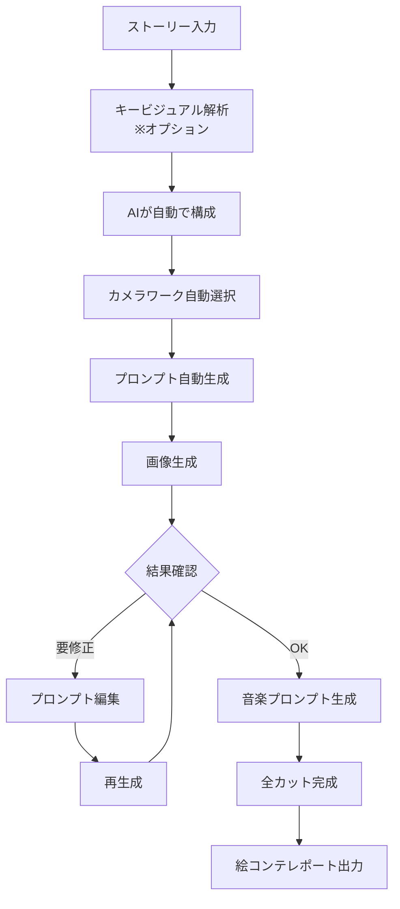

# AIビデオ制作スキル（ai-video-storyboard）詳細設計書

## 1. スキル概要

### 1.1 実装基盤

このプロジェクトは **Claude Code Skills** を使用して実装されています。

**Claude Skillsとは:**
- Anthropic社が提供するClaude AIエージェントの拡張機能フレームワーク
- 特定のタスクやワークフローを自然言語で指示するだけで自動実行できる仕組み
- Claude Code on the web、CLI、Desktop、APIの全てのClaude環境で動作

**本プロジェクトでの活用:**
- `.claude/skills/ai-video-storyboard/SKILL.md` にスキル定義を配置
- Claudeに「動画の絵コンテを作成して」と依頼するだけで、自動的にこのスキルが起動
- スクリプトの直接実行だけでなく、対話的なワークフローでも使用可能
- チーム内で共有可能なプロジェクトスキルとして設計

### 1.2 目的
AIビデオ制作における絵コンテ生成、画像生成、動画プロンプト作成を自動化し、1分間の動画（6-10カット）の制作ワークフローを効率化するスキル。

### 1.3 主要機能
- **絵コンテ自動生成**: ストーリーコンセプトから6-10カットの構成を自動生成
- **画像生成**: Gemini API（Imagen 3）を使用した各カットの最初のフレーム画像生成
- **ItoVプロンプト生成**: 画像から動画への変換用プロンプト自動生成
- **構図・カメラワーク選択**: シーンに適した構図とカメラワークの自動選択
- **キャラクター一貫性管理**: キャラクターの外見と特徴の一貫性維持

### 1.4 対象ユーザー
- 教育コンテンツ制作者
- マーケティング動画制作者
- アニメーション制作初心者
- AIツールを活用した動画制作者

## 2. スキル構造

### 2.1 ディレクトリ構成

```
ai-video-storyboard/
├── SKILL.md                        # スキルのメインドキュメント（必須）
├── scripts/                         # 実行可能スクリプト
│   ├── generate_storyboard.py      # メイン絵コンテ生成スクリプト
│   ├── generate_images.py          # Imagen 3画像生成
│   ├── generate_prompts.py         # プロンプト生成ロジック
│   ├── character_consistency.py    # キャラクター一貫性管理
│   └── utils.py                    # 共通ユーティリティ
├── references/                      # リファレンスドキュメント
│   ├── camera_shots.md             # カメラショット辞書
│   ├── composition_guide.md        # 構図ガイド
│   ├── camera_movements.md         # カメラムーブメント参照
│   ├── itov_patterns.md           # ItoVプロンプトパターン集
│   └── troubleshooting.md         # トラブルシューティングガイド
└── assets/                         # テンプレートとサンプル
    ├── templates/
    │   ├── storyboard_template.json
    │   ├── character_sheet.json
    │   └── shot_list_template.md
    └── examples/
        ├── sample_storyboards/
        │   ├── educational_video.json
        │   ├── marketing_video.json
        │   └── narrative_video.json
        └── sample_prompts.json
```

## 3. コンポーネント詳細設計

### 3.1 SKILL.md

```yaml
---
name: ai-video-storyboard
description: AI video production assistant for creating storyboards, image prompts, and ItoV prompts for 1-minute videos (6-10 cuts). Generates first-frame images using Gemini API (Imagen 3). Automatically selects optimal compositions and camera work. Use when creating AI-generated videos, storyboards, video production planning, or educational content with visual narratives.
---
```

主要セクション：
- **Prerequisites**: Gemini API キーの設定方法
- **Quick Start**: 基本的な使用方法
- **Workflow**: ステップバイステップのワークフロー
- **Advanced Features**: 高度な機能と設定
- **Troubleshooting**: よくある問題と解決策

### 3.2 スクリプト詳細

#### 3.2.1 generate_storyboard.py
**目的**: メインエントリーポイント、全体のワークフロー制御

**主要機能**:
```python
def create_complete_storyboard(story_description, config=None):
    """
    Parameters:
    - story_description: ストーリーの説明文
    - config: 設定オプション（duration, num_cuts, style, etc.）
    
    Returns:
    - StoryboardData: 完全な絵コンテデータ
    """
```

**処理フロー**:
1. ストーリー分析とカット分割
2. 各カットの詳細設計
3. 画像プロンプト生成
4. ItoVプロンプト生成
5. 画像生成
6. レポート出力

#### 3.2.2 generate_images.py
**目的**: Gemini API経由でImagen 3を使用した画像生成

**主要機能**:
```python
def generate_first_frames(prompts, output_dir):
    """
    各カットの最初のフレーム画像を生成
    
    Parameters:
    - prompts: 画像生成プロンプトのリスト
    - output_dir: 出力ディレクトリ
    
    Returns:
    - List[GeneratedImage]: 生成された画像情報
    """
```

**エラー処理**:
- API制限の管理
- 画像生成失敗時のリトライ
- セーフティフィルター対応

#### 3.2.3 generate_prompts.py
**目的**: 効果的なプロンプト生成ロジック

**主要機能**:
```python
def create_image_prompt(scene_data):
    """静止画用プロンプト生成"""
    
def create_video_prompt(scene_data, image_path):
    """ItoV用動画プロンプト生成"""
    
def optimize_prompt(prompt, style_guide):
    """プロンプトの最適化と改善"""
```

#### 3.2.4 character_consistency.py
**目的**: キャラクターの一貫性管理

**主要機能**:
```python
class CharacterManager:
    def register_character(self, character_data):
        """キャラクター情報の登録"""
    
    def get_character_prompt(self, character_id, scene_context):
        """シーンに応じたキャラクタープロンプト生成"""
    
    def maintain_consistency(self, prompts):
        """複数プロンプト間の一貫性チェック"""
```

#### 3.2.5 video_model_optimizer.py
**目的**: Veo3.1/Sora2モデル別のプロンプト最適化

**主要機能**:
```python
class VideoModelOptimizer:
    def __init__(self, target_model="auto"):
        """
        target_model: "veo3", "sora2", "auto"(両方生成)
        """
        self.model = target_model
    
    def generate_optimized_prompt(self, scene_data):
        """モデル別最適化プロンプト生成"""
        if self.model == "veo3":
            return self._generate_veo3_prompt(scene_data)
        elif self.model == "sora2":
            return self._generate_sora2_prompt(scene_data)
        else:  # auto
            return {
                "veo3": self._generate_veo3_prompt(scene_data),
                "sora2": self._generate_sora2_prompt(scene_data)
            }
    
    def _generate_veo3_prompt(self, scene_data):
        """Veo3.1用: 技術的・構造化プロンプト"""
        # フレーム単位の精密制御
        # 映画撮影用語の使用
        # タイムライン形式のアクション記述
        
    def _generate_sora2_prompt(self, scene_data):
        """Sora2用: 描写的・物語型プロンプト"""
        # 自然言語での流れる記述
        # 感情や雰囲気の詩的表現
        # コンテキスト重視の構成
    
    def convert_between_models(self, prompt, from_model, to_model):
        """モデル間プロンプト変換"""
    
    def recommend_model(self, scene_type):
        """シーンタイプに基づく最適モデル推奨"""
```

**モデル別プロンプト特性**:

| 特性 | Veo3.1 | Sora2 |
|------|--------|-------|
| **構造** | パラメータ列挙型 | 物語・描写型 |
| **時間制御** | `0-5s: action` | 「徐々に～」 |
| **カメラ** | `Dolly in 2m/s` | 「カメラが近づく」 |
| **スタイル** | `24fps, f/2.8` | 「映画のような」 |

#### 3.2.6 visual_reference_analyzer.py
**目的**: キービジュアル画像の分析と世界観の抽出

**主要機能**:
```python
class VisualReferenceAnalyzer:
    def analyze_key_visual(self, image_path):
        """キービジュアルから世界観を分析"""
        return {
            'style': self._detect_art_style(image_path),
            'color_palette': self._extract_colors(image_path),
            'composition': self._analyze_composition(image_path),
            'mood': self._detect_mood(image_path),
            'elements': self._identify_elements(image_path)
        }
    
    def apply_to_prompts(self, prompts, visual_analysis):
        """分析結果を全プロンプトに適用"""
        style_tokens = self._generate_style_tokens(visual_analysis)
        for prompt in prompts:
            prompt.add_style_reference(style_tokens)
        return prompts
    
    def generate_consistency_guide(self, visual_analysis):
        """ビジュアル一貫性ガイドライン生成"""
        return {
            'must_include': [],  # 必須要素
            'color_guide': {},   # 色彩ガイド
            'style_reference': {} # スタイル参照
        }
```

**画像分析パラメータ**:
- **スタイル検出**: イラスト/写実/アニメ/水彩など
- **色彩抽出**: 主要5色とその比率
- **構図分析**: 三分割法/中心構図/対角線など
- **ムード判定**: 明るい/暗い/神秘的/活発など
- **要素識別**: 人物/建物/自然/オブジェクト

#### 3.2.7 music_prompt_generator.py
**目的**: Suno用音楽プロンプトの生成

**主要機能**:
```python
class MusicPromptGenerator:
    def analyze_emotional_arc(self, storyboard):
        """ストーリーの感情曲線を分析"""
        return {
            'arc_type': 'rising/falling/wave',
            'peak_points': [],
            'mood_transitions': []
        }
    
    def divide_music_sections(self, storyboard):
        """音楽セクションの分割提案"""
        sections = []
        # 感情の変化点で区切る
        # 3-4カットを1セクションの目安
        return sections
    
    def generate_suno_prompts(self, sections):
        """Suno最適化プロンプト生成"""
        prompts = []
        for section in sections:
            prompt = {
                'cuts': section['cut_range'],
                'duration': section['duration'],
                'style': self._determine_music_style(section),
                'tempo': self._calculate_tempo(section),
                'mood': section['mood'],
                'instruments': self._suggest_instruments(section),
                'suno_prompt': self._build_suno_prompt(section)
            }
            prompts.append(prompt)
        return prompts
    
    def _build_suno_prompt(self, section):
        """Suno用プロンプト構築"""
        # Sunoが理解しやすい形式
        # ジャンル、BPM、楽器、ムード
        template = "[{genre}] {tempo}bpm, {mood}, {instruments}"
        return template.format(**section)
```

**音楽セクション分割例**:
```python
{
    "section_1": {
        "cuts": "1-3",
        "duration": "25s",
        "description": "オープニング・導入",
        "suno_prompt": "[Cinematic Orchestra] 80bpm, mysterious, strings and piano"
    },
    "section_2": {
        "cuts": "4-6",
        "duration": "20s", 
        "description": "展開・アクション",
        "suno_prompt": "[Epic Hybrid] 140bpm, intense, drums and brass"
    },
    "section_3": {
        "cuts": "7-8",
        "duration": "15s",
        "description": "解決・エンディング",
        "suno_prompt": "[Emotional Piano] 70bpm, uplifting, piano and strings"
    }
}
```

#### 3.2.6 image_analyzer.py
**目的**: キービジュアル画像の解析と世界観抽出

**主要機能**:
```python
class ImageAnalyzer:
    def __init__(self, api_key=None):
        """Gemini Vision APIを使用した画像解析"""
        self.client = genai.Client(api_key=api_key)
    
    def analyze_key_visual(self, image_path):
        """キービジュアルから世界観を抽出"""
        return {
            "style": self._detect_art_style(image_path),
            "colors": self._extract_color_palette(image_path),
            "mood": self._analyze_mood(image_path),
            "elements": self._identify_key_elements(image_path),
            "composition": self._analyze_composition(image_path)
        }
    
    def _detect_art_style(self, image_path):
        """アートスタイルの検出"""
        # アニメ、リアル、イラスト、3DCGなど
        prompt = """
        Analyze the art style of this image:
        - Animation style (anime, cartoon, realistic, etc.)
        - Rendering technique (2D, 3D, painted, etc.)
        - Visual characteristics
        Return as structured data.
        """
        
    def _extract_color_palette(self, image_path):
        """主要な色彩の抽出"""
        # 支配的な色、色温度、コントラストなど
        
    def _analyze_mood(self, image_path):
        """雰囲気・ムードの分析"""
        # 明るい、暗い、神秘的、活気があるなど
        
    def generate_style_guide(self, analysis_result):
        """解析結果からスタイルガイドを生成"""
        return {
            "prompt_modifiers": [],  # 全プロンプトに追加する修飾子
            "technical_specs": {},    # 技術仕様
            "consistency_rules": []   # 一貫性維持のルール
        }
    
    def apply_to_prompts(self, prompts, style_guide):
        """スタイルガイドを各カットのプロンプトに適用"""
        for prompt in prompts:
            prompt.update(style_guide["prompt_modifiers"])
        return prompts
```

**画像解析による世界観統一**:
- 色彩の一貫性（カラーパレット共有）
- スタイルの統一（アートスタイル維持）
- 雰囲気の継続（ムード保持）
- 構図パターンの活用

#### 3.2.7 music_prompt_generator.py
**目的**: Suno向けBGMプロンプト生成

**主要機能**:
```python
class MusicPromptGenerator:
    def __init__(self):
        """音楽プロンプト生成器の初期化"""
        self.music_styles = self._load_music_styles()
    
    def analyze_emotional_arc(self, storyboard):
        """ストーリーの感情曲線を分析"""
        emotional_curve = []
        for cut in storyboard.cuts:
            emotion = self._detect_emotion(cut)
            emotional_curve.append({
                "cut": cut.cut_number,
                "emotion": emotion,
                "intensity": self._measure_intensity(cut)
            })
        return emotional_curve
    
    def create_music_sections(self, storyboard):
        """音楽セクションの定義（複数カットをグループ化）"""
        sections = []
        current_section = []
        current_mood = None
        
        for cut in storyboard.cuts:
            cut_mood = self._get_cut_mood(cut)
            
            if current_mood != cut_mood:
                if current_section:
                    sections.append(current_section)
                current_section = [cut]
                current_mood = cut_mood
            else:
                current_section.append(cut)
        
        if current_section:
            sections.append(current_section)
        
        return sections
    
    def generate_suno_prompts(self, music_sections, storyboard):
        """Suno向けプロンプト生成"""
        suno_prompts = []
        
        for i, section in enumerate(music_sections):
            prompt = self._create_single_suno_prompt(
                section,
                storyboard.style_guide,
                position=i  # intro, main, climax, outro
            )
            
            suno_prompts.append({
                "section_id": i + 1,
                "cuts": [cut.cut_number for cut in section],
                "duration": sum(cut.duration for cut in section),
                "prompt": prompt,
                "style_tags": self._get_style_tags(section),
                "bpm_suggestion": self._suggest_bpm(section)
            })
        
        return suno_prompts
    
    def _create_single_suno_prompt(self, section, style_guide, position):
        """単一セクション用のSunoプロンプト作成"""
        
        # セクションの特徴を分析
        mood = self._analyze_section_mood(section)
        energy = self._calculate_energy_level(section)
        
        # 位置に応じた構成
        structure = {
            0: "intro",  # 導入部
            -1: "outro",  # 終結部
        }.get(position, "main")
        
        # プロンプトテンプレート
        template = f"""
        [{mood} {structure}]
        Style: {style_guide.get('music_genre', 'cinematic')}
        Energy: {energy}/10
        Instruments: {self._suggest_instruments(mood, energy)}
        Mood: {self._describe_mood(section)}
        """
        
        return template.strip()
    
    def _suggest_instruments(self, mood, energy):
        """ムードとエネルギーに基づく楽器提案"""
        instrument_map = {
            ("calm", "low"): ["piano", "strings", "ambient pad"],
            ("tense", "high"): ["drums", "bass", "synth", "orchestra hits"],
            ("happy", "medium"): ["acoustic guitar", "light percussion", "bells"],
            ("sad", "low"): ["cello", "violin", "piano"],
            ("epic", "high"): ["full orchestra", "choir", "timpani"]
        }
        
    def generate_timing_sheet(self, suno_prompts, storyboard):
        """タイミングシート生成（同期用）"""
        timing = []
        current_time = 0
        
        for prompt_data in suno_prompts:
            timing.append({
                "section": prompt_data["section_id"],
                "start_time": current_time,
                "end_time": current_time + prompt_data["duration"],
                "cuts": prompt_data["cuts"],
                "cue_points": self._identify_cue_points(prompt_data, storyboard)
            })
            current_time += prompt_data["duration"]
        
        return timing
```

**音楽セクション分割パターン**:

| パターン | 説明 | 適用例 |
|---------|------|--------|
| **3分割** | イントロ・メイン・アウトロ | 短い動画、シンプルな構成 |
| **起承転結** | 4セクション構成 | 物語性のある動画 |
| **感情別** | 感情の変化でセクション分け | ドラマチックな展開 |
| **シーン別** | 場面転換で区切る | 場所や時間が変わる動画 |

### 3.3 リファレンスドキュメント（自動選択＋学習用）

#### 設計方針：自動選択を基本としたイテレーティブ改善

**基本フロー**：
1. **自動生成** → AIが最適なカメラワークを自動選択
2. **確認** → 生成された画像とプロンプトを確認
3. **調整** → 必要に応じてプロンプトを修正して再生成

#### 3.3.1 camera_shots.md（詳細解説＋自動選択ルール）

**自動選択ロジック**：
```python
# スクリプト内で自動実行される選択ルール
scene_camera_rules = {
    'establishing': 'ELS',  # 場所の確立
    'character_intro': 'MS',  # キャラクター紹介
    'dialogue': 'MS/MCU',  # 会話シーン
    'action': 'LS/MS',  # アクションシーン
    'emotion': 'CU/ECU',  # 感情表現
    'conclusion': 'LS/ELS'  # 締めくくり
}
```

**各ショットの詳細解説**：

##### Extreme Long Shot (ELS) - 超遠景
- **自動選択される場面**: オープニング、場面転換、エンディング
- **視覚効果**: 壮大さ、孤独感、環境との関係性
- **プロンプトキーワード**: `extreme wide shot, aerial view, vast landscape, establishing shot`
- **修正のヒント**: 「もっと近づきたい」→ LS に変更、「ドローン視点」→ `drone aerial view` 追加

##### Long Shot (LS) - 遠景  
- **自動選択される場面**: アクション全体、グループショット
- **視覚効果**: 全身と環境のバランス
- **プロンプトキーワード**: `wide shot, full body visible, environmental context`
- **修正のヒント**: 「表情を見たい」→ MS に変更

##### Medium Shot (MS) - 中景
- **自動選択される場面**: 会話、通常のアクション
- **視覚効果**: 親近感とコンテキストのバランス
- **プロンプトキーワード**: `medium shot, waist up, conversational distance`
- **修正のヒント**: 「もっとダイナミックに」→ カメラムーブメント追加

##### Close-Up (CU) - クローズアップ
- **自動選択される場面**: 感情的な瞬間、重要な詳細
- **視覚効果**: 親密さ、感情の強調
- **プロンプトキーワード**: `close-up shot, face and shoulders, emotional focus`
- **修正のヒント**: 「目だけ映したい」→ ECU に変更

##### Extreme Close-Up (ECU) - 超クローズアップ
- **自動選択される場面**: 極度の感情、細部の強調
- **視覚効果**: 緊張感、集中
- **プロンプトキーワード**: `extreme close-up, eyes only, intense detail`
- **修正のヒント**: 使いすぎ注意、インパクトが薄れる

#### 3.3.2 composition_guide.md（構図の自動選択と調整）

**自動選択マトリックス**：
```python
composition_matrix = {
    'opening': 'rule_of_thirds',      # 安定した導入
    'character': 'centered/golden',    # キャラクターフォーカス
    'dialogue': 'over_shoulder',       # 会話の自然な構図
    'action': 'diagonal',              # ダイナミックな動き
    'emotion': 'centered_tight',       # 感情への集中
    'landscape': 'golden_ratio'        # 美的な風景
}
```

**構図タイプと修正方法**：

##### 三分割法（Rule of Thirds）
- **自動適用**: 汎用的なシーン、風景、日常場面
- **効果**: バランスが良く、自然な印象
- **プロンプト修正例**:
  - 基本: `rule of thirds composition`
  - 強調: `subject on left third, looking right`
  - 調整: `slightly off-center for dynamic balance`

##### 黄金比（Golden Ratio）  
- **自動適用**: 芸術的なシーン、美しさを強調したい場面
- **効果**: 数学的に美しい、洗練された印象
- **プロンプト修正例**:
  - 基本: `golden ratio composition`
  - 螺旋: `fibonacci spiral composition`
  - 調整: `divine proportion layout`

##### 中心構図（Centered Composition）
- **自動適用**: キャラクター紹介、シンメトリー、フォーマルな場面
- **効果**: 力強い、直接的、フォーマル
- **プロンプト修正例**:
  - 基本: `centered composition, symmetrical`
  - 強調: `dead center, perfect symmetry`
  - 緩和: `slightly off-center for subtle tension`

##### 対角線構図（Diagonal Composition）
- **自動適用**: アクション、動きのあるシーン、緊張感
- **効果**: ダイナミック、スピード感、不安定さ
- **プロンプト修正例**:
  - 基本: `diagonal composition, dynamic angles`
  - 強調: `strong diagonal lines, 45-degree angle`
  - 調整: `subtle diagonal for gentle movement`

#### 3.3.3 camera_movements.md（カメラワークの自動選択）

**シーン別自動選択**：
```python
movement_selection = {
    'opening': 'slow_zoom_in/establishing_pan',
    'dialogue': 'static/gentle_push',
    'action': 'tracking/handheld',
    'revelation': 'dolly_in/crane_up',
    'ending': 'slow_pull_back/fade'
}
```

**カメラムーブメントと調整**：

##### Static（固定）
- **自動選択**: 会話、観察、静かなシーン
- **ItoVプロンプト**: `static camera, no movement, stable frame`
- **調整例**: 「少し動きが欲しい」→ `subtle breathing movement` 追加

##### Pan（パン）
- **自動選択**: 広い空間の紹介、追跡
- **ItoVプロンプト**: `camera pans right slowly, smooth horizontal movement`
- **調整例**: 
  - 速度調整: `fast pan` / `slow deliberate pan`
  - 方向: `pan left to right following action`

##### Zoom（ズーム）
- **自動選択**: 注目の誘導、驚きの表現
- **ItoVプロンプト**: `slow zoom in, increasing tension`
- **調整例**:
  - 強度: `dramatic zoom` / `subtle zoom`
  - 速度: `quick zoom` / `gradual zoom over 5 seconds`

##### Dolly（ドリー）
- **自動選択**: 没入感、キャラクターへの接近
- **ItoVプロンプト**: `dolly forward, camera moves toward subject`
- **調整例**:
  - 組み合わせ: `dolly zoom (vertigo effect)`
  - 方向: `dolly back revealing environment`

##### Tracking（トラッキング）
- **自動選択**: アクションの追従、並走
- **ItoVプロンプト**: `tracking shot following character movement`
- **調整例**:
  - スタイル: `smooth steadicam tracking`
  - 位置: `parallel tracking from side`

#### 3.3.4 itov_patterns.md（ItoVプロンプトの最適化パターン）

**基本構造**：
```
[カメラ動作] + [被写体の動き] + [継続時間] + [雰囲気] + [一貫性指示]
```

**シーン別最適化テンプレート**：

##### オープニングシーン
```
slow zoom in, subtle environmental movement, 
10 seconds, establishing mood, 
maintain first frame composition throughout
```

##### 会話シーン  
```
static camera with slight drift, 
natural gestures and facial expressions,
8 seconds, conversational pacing,
keep characters in frame
```

##### アクションシーン
```
dynamic camera movement following action,
fast-paced character movement,
5 seconds, high energy,
maintain motion blur for speed
```

##### 感情的シーン
```
slow push in on face, 
subtle facial micro-expressions,
12 seconds, emotional intensity building,
maintain eye contact with camera
```

**プロンプト改善のコツ**：
1. **具体的な時間指定**: `5 seconds` より `gradually over 5 seconds`
2. **動きの質**: `move` より `glide smoothly` / `jerk suddenly`
3. **一貫性の強調**: 必ず `maintain first frame` 系の指示を含める
4. **物理法則**: `natural physics` / `realistic motion` を追加

#### 3.3.5 video_model_patterns.md（Veo3.1/Sora2モデル別最適化）

**モデル特性比較**：

| 項目 | Veo3.1 (Google) | Sora2 (OpenAI) |
|------|-----------------|----------------|
| **プロンプトスタイル** | 技術的・明示的 | 自然言語的・描写的 |
| **時間制御** | フレーム単位で細かく指定可能 | シーン全体の流れを記述 |
| **カメラワーク** | 映画用語を正確に理解 | より直感的な表現を好む |
| **スタイル指定** | 具体的な技術パラメータ | アーティスティックな表現 |
| **物理シミュレーション** | 高精度な物理演算 | 自然な動きの近似 |
| **得意分野** | アクション、技術的ショット | 感情表現、芸術的シーン |

**Veo3.1プロンプト構造**：
```python
veo3_template = """
[Shot Settings]
Shot size: {shot_size}
Duration: {duration} seconds
FPS: {fps}
Aspect ratio: 16:9

[Camera Movement]
Type: {camera_movement}
Speed: {movement_speed}
Path: {movement_path}

[Timeline]
0-3s: {action_1}
3-6s: {action_2}
6-10s: {action_3}

[Technical Specs]
Lighting: {lighting_setup}
DOF: {depth_of_field}
Color grade: {color_grade}
"""
```

**Sora2プロンプト構造**：
```python
sora2_template = """
{opening_atmosphere}. {camera_description} 
{subject_introduction}, {action_flow}. 
{emotional_undertone}, {visual_metaphor}.
{stylistic_description}, {closing_impression}.
"""
```

**シーンタイプ別推奨モデル**：

| シーンタイプ | 推奨モデル | 理由 |
|------------|-----------|------|
| 高速アクション | Veo3.1 | 精密な時間制御、物理演算 |
| 感情的な瞬間 | Sora2 | 微妙な表情、雰囲気表現 |
| 技術的デモ | Veo3.1 | 正確な動作再現 |
| 芸術的表現 | Sora2 | 創造的解釈、美的センス |
| 群集シーン | Veo3.1 | 複雑な動きの制御 |
| 自然風景 | 両方可 | それぞれの強みを活用 |

**プロンプト変換例**：

```python
# 共通シーン：教室での勉強シーン

# Veo3.1向け（技術的）
veo3_prompt = """
Shot size: Medium shot
Duration: 10 seconds
Camera: Static tripod, eye level
Position: 2m from subject

Timeline:
0-3s: Student reading textbook
3-5s: Look up, thinking gesture
5-8s: Write notes on paper
8-10s: Return to reading

Technical:
Lighting: Natural daylight, 5600K, from left
DOF: f/2.8, background blur
Style: Photorealistic, rec709 color space
"""

# Sora2向け（描写的）
sora2_prompt = """
In a serene classroom bathed in warm afternoon sunlight,
a dedicated student sits absorbed in their studies.
The golden rays streaming through the window create
a peaceful atmosphere as they alternate between 
reading their textbook and carefully taking notes.
There's a moment of contemplation as they pause,
pen in hand, processing the information before
returning to their work with renewed focus.
The scene captures the quiet beauty of learning,
rendered in a cinematic, naturalistic style.
"""

# 自動変換関数での処理
def auto_convert(veo3_prompt):
    # Veo3の技術仕様を抽出
    # Sora2の描写的表現に変換
    # 感情や雰囲気を追加
    return sora2_prompt
```

#### 3.3.6 visual_style_extraction.md（キービジュアル解析ガイド）

**画像解析で抽出する要素**：

| 要素 | 抽出内容 | プロンプトへの反映 |
|------|---------|------------------|
| **アートスタイル** | 2D/3D、アニメ/リアル | スタイル指定子として全カットに適用 |
| **カラーパレット** | 主要5色、色温度 | 色指定、ムード設定 |
| **構図傾向** | 対称/非対称、静的/動的 | カメラワークの基調 |
| **ライティング** | 方向、強度、色温度 | 照明設定の統一 |
| **テクスチャ** | 質感、ディテールレベル | レンダリング品質指定 |

**解析プロセス**：
```python
# Gemini Vision APIを使用した解析
analysis_prompt = """
Analyze this image as a visual style reference:
1. Art style (anime, realistic, painterly, etc.)
2. Color palette (dominant colors, temperature)
3. Lighting (direction, quality, mood)
4. Composition (rule of thirds, symmetry, etc.)
5. Atmosphere and mood
6. Technical rendering style
Return structured JSON data.
"""
```

**スタイル継承ルール**：
1. **強制継承要素**（必ず全カットに適用）
   - アートスタイル
   - 基本カラーパレット
   - レンダリング手法

2. **推奨継承要素**（シーンに応じて調整可）
   - 構図パターン
   - ライティング方向
   - 雰囲気

3. **シーン優先要素**（ストーリーに応じて変更可）
   - カメラアングル
   - 被写界深度
   - 動きの質

#### 3.3.7 music_generation_patterns.md（BGM生成パターン集）

**感情曲線とBGMの対応**：

| 感情状態 | 推奨ジャンル | 楽器編成 | BPM目安 |
|---------|------------|---------|---------|
| 平穏・導入 | Ambient/Classical | Piano, Strings | 60-80 |
| 期待・準備 | Pop/Orchestral | + Percussion | 80-100 |
| 緊張・不安 | Suspense/Electronic | Synth, Low strings | 100-120 |
| アクション | Rock/Electronic | Full band/Orchestra | 120-140 |
| 感動・達成 | Epic Orchestral | Full orchestra + Choir | 100-120 |
| 余韻・終結 | Ambient/Piano | Solo piano, Strings | 60-80 |

**Suno用プロンプトテンプレート**：
```
[Section Name]
Genre: {musical_genre}
Mood: {emotional_descriptors}
Instruments: {instrument_list}
Tempo: {bpm} BPM, {time_signature}
Energy: {1-10}/10
Key: {musical_key}
Style: {reference_style}
Features: {unique_elements}
```

**音楽セクション分割戦略**：

1. **感情ベース分割**
   - 感情が大きく変化する地点で区切る
   - 各セクション2-4カット程度

2. **構造ベース分割**
   - 起承転結に合わせて3-4分割
   - イントロ・メイン・クライマックス・アウトロ

3. **時間ベース分割**
   - 15-20秒ごとに区切る
   - Sunoの生成制限に合わせる

**同期ポイントの設定**：
```python
sync_points = {
    "hard_sync": [  # 必ず合わせる
        "first_frame",
        "climax_start",
        "final_frame"
    ],
    "soft_sync": [  # 緩やかに合わせる
        "mood_changes",
        "scene_transitions"
    ],
    "accent_points": [  # アクセント
        "key_actions",
        "emotional_peaks"
    ]
}
```

### 3.4 アセット

#### 3.4.1 テンプレート
- **storyboard_template.json**: 絵コンテの標準構造
- **character_sheet.json**: キャラクター定義テンプレート
- **shot_list_template.md**: ショットリストのMarkdownテンプレート

#### 3.4.2 サンプル
- 教育動画の絵コンテ例
- マーケティング動画の絵コンテ例
- ナラティブ動画の絵コンテ例

## 4. ワークフロー詳細

### 4.1 基本ワークフロー（自動生成＋イテレーティブ改善）



### 4.2 詳細ステップ（自動処理とカスタマイズポイント）

#### ステップ0: キービジュアル解析【オプション】
```python
# 画像を入力した場合のみ実行
if key_visual_image:
    analyzer = ImageAnalyzer()
    visual_analysis = analyzer.analyze_key_visual(key_visual_image)
    
    # 世界観を抽出
    style_guide = analyzer.generate_style_guide(visual_analysis)
    
    print(f"検出されたスタイル: {visual_analysis['style']}")
    print(f"主要色彩: {visual_analysis['colors']}")
    print(f"雰囲気: {visual_analysis['mood']}")
```

**画像解析で得られる情報**:
- アートスタイル（アニメ、リアル、水彩画風など）
- カラーパレット（主要5色と色温度）
- 雰囲気（明るい、ダーク、幻想的など）
- 構図傾向（対称、動的、ミニマルなど）

#### ステップ1: ストーリー分析【完全自動・キービジュアル反映】
```python
# キービジュアルがある場合は世界観を統合
if style_guide:
    create_storyboard(
        "学校の文化祭で友情を深める60秒の物語",
        key_visual_style=style_guide  # 世界観を継承
    )
else:
    # 従来通りテキストのみで生成
    create_storyboard("学校の文化祭で友情を深める60秒の物語")
```

**AIが自動で行うこと**：
- ジャンル判定 → 青春/学園もの
- 感情曲線分析 → 期待→挑戦→協力→達成
- キーモーメント特定 → 準備開始、困難、協力、成功
- カット数決定 → 8カット（60秒÷8）
- **キービジュアル反映** → 全カットに統一スタイル適用

#### ステップ2: カット設計【自動＋確認可能】

**自動生成される構成例**：
```
Cut 1 (10s): 朝の教室 - ELS - 三分割法 - ゆっくりズームイン
Cut 2 (8s): 主人公紹介 - MS - 中心構図 - 固定
Cut 3 (7s): 仲間との会話 - MS - オーバーショルダー - カット切り替え
Cut 4 (8s): 準備作業 - LS - 対角線構図 - パン
Cut 5 (7s): トラブル発生 - CU - 中心構図 - ハンドヘルド
Cut 6 (8s): 協力して解決 - MS - 三分割法 - トラッキング
Cut 7 (7s): 完成の瞬間 - CU - 中心構図 - スローズーム
Cut 8 (5s): 全景 - ELS - 黄金比 - ゆっくり引き
```

#### ステップ3: プロンプト生成と確認【自動＋編集可能】

**初回自動生成プロンプト（キービジュアル対応）**：
```python
# Cut 1の自動生成プロンプト
base_prompt = """
extreme wide shot, high angle, early morning classroom, 
students preparing for school festival, warm sunlight through windows,
rule of thirds composition, nostalgic mood, anime style, 16:9
"""

# キービジュアルがある場合、スタイルを自動適用
if visual_analysis:
    image_prompt = apply_visual_reference(base_prompt, visual_analysis)
    # 例: visual_analysis['style'] = "watercolor anime"
    # 例: visual_analysis['colors'] = ["#FFE4B5", "#87CEEB", ...]
    
    image_prompt = f"""
    extreme wide shot, high angle, early morning classroom,
    students preparing for school festival, warm sunlight through windows,
    rule of thirds composition, nostalgic mood,
    {visual_analysis['style']},  # キービジュアルのスタイル
    color palette: {', '.join(visual_analysis['colors'][:3])},  # 主要色
    matching visual reference style,  # 一貫性の指示
    16:9
    """

# 結果を見て調整したい場合
adjusted_prompt = """
extreme wide shot, eye level, [カメラアングルを変更]
busy classroom with colorful decorations, [詳細を追加]
students in school uniforms working together,
golden hour lighting, [照明を変更]
rule of thirds composition, energetic mood, 
maintain key visual style consistency,  # キービジュアルとの一貫性維持
anime style, 16:9
"""
```

#### ステップ4: イテレーティブな画像生成

```python
# 1. 初回生成
result = generate_image(cut_1_prompt)
# → output/frames/cut_01_v1.jpg

# 2. 確認して修正が必要な場合
if "もっと明るく、生徒を増やしたい":
    cut_1_prompt_v2 = modify_prompt(
        original=cut_1_prompt,
        changes="brighter lighting, more students, festive atmosphere"
    )
    result = generate_image(cut_1_prompt_v2)
    # → output/frames/cut_01_v2.jpg

# 3. 満足したら次のカットへ
confirm_and_proceed()
```

#### ステップ5: ItoVプロンプトの調整

**自動生成されるItoVプロンプト**：
```python
video_prompt_auto = """
slow zoom in, bustling student activity,
10 seconds, establishing mood,
maintain first frame composition
"""

# カメラワークを調整したい場合
video_prompt_custom = """
slow pan right then zoom in, [カメラ動作を変更]
students moving naturally, papers rustling,
10 seconds, building excitement,
maintain character positions
"""
```

#### ステップ6: 最終出力と再調整オプション

**生成される成果物**：
1. **storyboard.json** - 全データ（プロンプト履歴含む）
2. **storyboard_report.md** - ビジュアルレポート
3. **frames/** - 生成された画像（バージョン管理）
4. **prompts_history.json** - 修正履歴（学習用）

#### ステップ7: BGMプロンプト生成【自動】

```python
# 絵コンテ完成後、BGMプロンプトを自動生成
music_generator = MusicPromptGenerator()

# 感情曲線を分析
emotional_arc = music_generator.analyze_emotional_arc(storyboard)

# 音楽セクションを定義
music_sections = music_generator.create_music_sections(storyboard)

# Suno用プロンプト生成
suno_prompts = music_generator.generate_suno_prompts(
    music_sections,
    storyboard
)
```

**生成されるBGM構成例**：
```python
{
    "section_1": {
        "cuts": [1, 2, 3],  # カット1-3
        "duration": 25,  # 秒
        "prompt": "[Hopeful intro] Cinematic orchestral, Energy: 4/10, 
                   Instruments: piano, strings, soft percussion,
                   Mood: anticipation building, morning atmosphere",
        "bpm": 80
    },
    "section_2": {
        "cuts": [4, 5, 6],  # カット4-6
        "duration": 20,
        "prompt": "[Energetic main] Uplifting pop-rock, Energy: 7/10,
                   Instruments: guitar, drums, bass, synth,
                   Mood: excitement, teamwork, positive energy",
        "bpm": 120
    },
    "section_3": {
        "cuts": [7, 8],  # カット7-8
        "duration": 15,
        "prompt": "[Triumphant outro] Epic orchestral finale, Energy: 9/10,
                   Instruments: full orchestra, choir, timpani,
                   Mood: victory, celebration, emotional peak",
        "bpm": 140
    }
}
```

**音楽同期タイミングシート**：
```markdown
| 時間 | カット | 音楽セクション | キューポイント |
|------|--------|--------------|---------------|
| 0:00 | Cut 1 | Section 1開始 | 静かなピアノ導入 |
| 0:10 | Cut 2 | Section 1継続 | ストリングス追加 |
| 0:18 | Cut 3 | Section 1継続 | ビルドアップ |
| 0:25 | Cut 4 | Section 2開始 | ドラムイン |
| 0:33 | Cut 5 | Section 2継続 | メインメロディ |
| 0:40 | Cut 6 | Section 2継続 | ブリッジ |
| 0:45 | Cut 7 | Section 3開始 | クライマックス |
| 0:52 | Cut 8 | Section 3継続 | フィナーレ |
```

### 4.3 プロンプト修正ガイド

#### よくある修正パターンと解決方法

| 問題 | 修正方法 | プロンプト変更例 |
|------|---------|----------------|
| 暗すぎる | 照明を追加 | + `bright lighting, well-lit` |
| 人が少ない | 人数指定 | + `crowded, many students` |
| 構図が偏る | 構図を明示 | + `perfectly centered` |
| 動きが硬い | 自然な動き | + `natural movement, casual poses` |
| スタイルが違う | スタイル強調 | + `anime style, cel-shaded` |

#### プロンプト改善のベストプラクティス

1. **追加より置換**
   - ❌ 悪い例: 元のプロンプト + 新しい要素をどんどん追加
   - ✅ 良い例: 問題のある部分を特定して置換

2. **具体的な指示**
   - ❌ 悪い例: `better lighting`
   - ✅ 良い例: `soft morning sunlight from left window`

3. **優先順位を意識**
   - プロンプトの前半により注意が払われる
   - 重要な要素は前に配置

4. **ネガティブプロンプトの活用**
   - 避けたい要素を明示: `no shadows, no blur`

### 4.4 バッチ処理とバージョン管理

#### 複数バージョンの管理

```python
# 各カットで複数バージョンを生成して選択
for cut in storyboard.cuts:
    versions = []
    for i in range(3):  # 3バージョン生成
        variant_prompt = add_variation(cut.image_prompt, seed=i)
        image = generate_image(variant_prompt)
        versions.append(image)
    
    # ベストを選択
    best_version = select_best(versions)
    cut.final_image = best_version
```

#### 学習用データの蓄積

```python
# プロンプト改善履歴を保存
improvement_log = {
    "cut_1": {
        "original": "initial prompt...",
        "iterations": [
            {"version": 1, "change": "added lighting", "result": "better"},
            {"version": 2, "change": "changed angle", "result": "perfect"}
        ],
        "final": "final prompt...",
        "lessons": "High angle worked better than eye level"
    }
}
```

## 5. API仕様

### 5.1 Gemini API設定

```python
# 環境変数
GEMINI_API_KEY = "your-api-key"

# API設定
MODEL_IMAGE = "imagen-3.0-generate-002"
MODEL_TEXT = "gemini-2.0-flash-exp"

# 制限事項
MAX_IMAGES_PER_BATCH = 4
RATE_LIMIT = 60  # requests per minute
IMAGE_COST = 0.03  # USD per image
```

### 5.2 主要データ構造

```python
@dataclass
class StoryboardData:
    title: str
    duration: int
    num_cuts: int
    cuts: List[CutData]
    characters: List[CharacterData]
    style_guide: StyleGuide
    key_visual_analysis: Optional[Dict]  # 追加：キービジュアル解析結果
    music_sections: Optional[List[MusicSection]]  # 追加：BGMセクション

@dataclass
class CutData:
    cut_number: int
    duration: int
    scene_description: str
    action: str
    composition: str
    camera_angle: str
    camera_movement: str
    lighting: str
    mood: str
    image_prompt: str
    video_prompt: str
    generated_image_path: Optional[str]
    style_modifiers: Optional[List[str]]  # 追加：キービジュアルからのスタイル
    color_palette: Optional[Dict]  # 追加：色彩指定

@dataclass
class MusicSection:
    section_id: int
    cuts: List[int]
    duration: int
    suno_prompt: str
    style_tags: List[str]
    bpm: int
    energy_level: int
    transition_type: Optional[str]
```

### 5.3 統合メインスクリプトの更新例

```python
#!/usr/bin/env python3
"""
AI Video Storyboard Generator with Visual Reference and Music Generation
Enhanced version with key visual analysis and BGM prompt generation
"""

from ai_video_storyboard import (
    StoryboardGenerator,
    ImageAnalyzer,
    MusicPromptGenerator,
    VideoModelOptimizer
)

def create_enhanced_storyboard(
    story_description: str,
    key_visual_path: Optional[str] = None,
    generate_music: bool = True,
    video_model: str = "auto",
    output_dir: str = "output"
):
    """
    拡張版絵コンテ生成（キービジュアル＋BGM対応）
    
    Args:
        story_description: ストーリーの説明
        key_visual_path: キービジュアル画像のパス（オプション）
        generate_music: BGMプロンプトを生成するか
        video_model: ビデオ生成モデル（veo3/sora2/auto）
        output_dir: 出力ディレクトリ
    """
    
    # Step 1: キービジュアル解析（あれば）
    style_guide = None
    visual_analysis = None
    
    if key_visual_path:
        print("📸 キービジュアルを解析中...")
        analyzer = ImageAnalyzer()
        visual_analysis = analyzer.analyze_key_visual(key_visual_path)
        style_guide = analyzer.generate_style_guide(visual_analysis)
        
        print(f"  検出されたスタイル: {visual_analysis['style']}")
        print(f"  主要色彩: {visual_analysis['colors'][:3]}")
        print(f"  雰囲気: {visual_analysis['mood']}")
    
    # Step 2: 絵コンテ生成
    print("\n📝 絵コンテを生成中...")
    generator = StoryboardGenerator()
    
    storyboard = generator.generate_complete_storyboard(
        story_description,
        key_visual_style=style_guide,
        config={
            "video_model": video_model,
            "visual_analysis": visual_analysis
        }
    )
    
    print(f"  {storyboard.num_cuts}カットの絵コンテを生成しました")
    
    # Step 3: モデル別最適化（Veo3.1/Sora2）
    if video_model == "auto":
        print("\n🎬 ビデオモデル別プロンプトを生成中...")
        optimizer = VideoModelOptimizer(target_model="auto")
        
        for cut in storyboard.cuts:
            prompts = optimizer.generate_optimized_prompt(cut.__dict__)
            cut.veo3_prompt = prompts.get("veo3")
            cut.sora2_prompt = prompts.get("sora2")
            
            # 推奨モデルを判定
            recommendation = optimizer.recommend_model(cut.__dict__)
            cut.recommended_model = recommendation["recommended_model"]
    
    # Step 4: BGMプロンプト生成
    music_data = None
    if generate_music:
        print("\n🎵 BGMプロンプトを生成中...")
        music_gen = MusicPromptGenerator()
        
        # 感情曲線分析
        emotional_arc = music_gen.analyze_emotional_arc(storyboard)
        
        # 音楽セクション作成
        music_sections = music_gen.create_music_sections(storyboard)
        print(f"  {len(music_sections)}セクションに分割")
        
        # Sunoプロンプト生成
        suno_prompts = music_gen.generate_suno_prompts(
            music_sections,
            storyboard
        )
        
        # タイミングシート生成
        timing_sheet = music_gen.generate_timing_sheet(
            suno_prompts,
            storyboard
        )
        
        music_data = {
            "emotional_arc": emotional_arc,
            "sections": music_sections,
            "suno_prompts": suno_prompts,
            "timing_sheet": timing_sheet
        }
        
        # 絵コンテに音楽情報を追加
        storyboard.music_sections = music_sections
    
    # Step 5: レポート生成
    print("\n📊 レポートを生成中...")
    
    # 統合レポート作成
    create_enhanced_report(
        storyboard,
        visual_analysis,
        music_data,
        output_dir
    )
    
    print(f"\n✅ 完成！")
    print(f"📁 出力先: {output_dir}/")
    print(f"  📄 storyboard_enhanced.json")
    print(f"  📄 storyboard_report.md")
    print(f"  🎵 music_prompts.json")
    print(f"  🖼️ frames/")
    
    return storyboard


def create_enhanced_report(storyboard, visual_analysis, music_data, output_dir):
    """
    拡張版レポートの生成
    """
    report = []
    
    # ヘッダー
    report.append(f"# {storyboard.title}")
    report.append("")
    
    # キービジュアル情報（あれば）
    if visual_analysis:
        report.append("## 🎨 ビジュアルスタイルガイド")
        report.append(f"- **アートスタイル**: {visual_analysis['style']}")
        report.append(f"- **カラーパレット**: {visual_analysis['colors']}")
        report.append(f"- **雰囲気**: {visual_analysis['mood']}")
        report.append("")
    
    # 絵コンテ
    report.append("## 🎬 絵コンテ")
    for cut in storyboard.cuts:
        report.append(f"\n### Cut {cut.cut_number} ({cut.duration}秒)")
        if cut.generated_image_path:
            report.append(f"")
        report.append(f"**シーン**: {cut.scene_description}")
        report.append(f"**推奨モデル**: {getattr(cut, 'recommended_model', 'N/A')}")
        report.append("")
    
    # BGM情報（あれば）
    if music_data:
        report.append("## 🎵 BGMプロンプト")
        for section in music_data['suno_prompts']:
            report.append(f"\n### Section {section['section_id']}")
            report.append(f"**カット**: {section['cuts']}")
            report.append(f"**長さ**: {section['duration']}秒")
            report.append(f"**BPM**: {section['bpm_suggestion']}")
            report.append("```")
            report.append(section['prompt'])
            report.append("```")
    
    # ファイル保存
    with open(f"{output_dir}/storyboard_report.md", "w", encoding="utf-8") as f:
        f.write("\n".join(report))


# 使用例
if __name__ == "__main__":
    import argparse
    
    parser = argparse.ArgumentParser(
        description="AI Video Storyboard Generator with Visual and Music"
    )
    parser.add_argument("story", help="Story description")
    parser.add_argument("--key-visual", help="Path to key visual image")
    parser.add_argument("--no-music", action="store_true", help="Skip BGM generation")
    parser.add_argument("--model", default="auto", choices=["veo3", "sora2", "auto"])
    parser.add_argument("--output", default="output", help="Output directory")
    
    args = parser.parse_args()
    
    storyboard = create_enhanced_storyboard(
        story_description=args.story,
        key_visual_path=args.key_visual,
        generate_music=not args.no_music,
        video_model=args.model,
        output_dir=args.output
    )
```

## 6. 使用例

### 6.1 基本的な使用（完全自動）

```bash
# 環境変数設定
export GEMINI_API_KEY='your-key'

# 1行で絵コンテ生成（AIが全て自動判断）
python scripts/generate_storyboard.py \
  "高校の文化祭準備を題材にした60秒の青春動画"

# キービジュアルありの場合
python scripts/generate_storyboard.py \
  "高校の文化祭準備を題材にした60秒の青春動画" \
  --key-visual "path/to/reference_image.jpg"

# 出力
# ✅ AIが自動で以下を決定：
# - 8カット構成
# - 各カットのカメラワーク
# - 構図（三分割法、中心構図など）
# - カメラムーブメント
# - 照明とムード
# - キービジュアルからのスタイル継承（画像入力時）
# - BGM構成とSunoプロンプト
```

### 6.1.1 キービジュアルを使用した世界観統一

```python
from ai_video_storyboard import StoryboardGenerator, ImageAnalyzer

# キービジュアルの解析
analyzer = ImageAnalyzer()
visual_ref = analyzer.analyze_key_visual("concept_art.jpg")

print(f"検出されたスタイル: {visual_ref['style']}")
# 出力: "watercolor anime with soft edges"

print(f"カラーパレット: {visual_ref['colors']}")
# 出力: ["#FFE4B5", "#87CEEB", "#98FB98", "#FFB6C1", "#DDA0DD"]

# スタイルを全カットに適用
generator = StoryboardGenerator()
storyboard = generator.generate_complete_storyboard(
    story="魔法学校の一日",
    key_visual=visual_ref,
    config={
        "enforce_visual_consistency": True,
        "style_weight": 0.8  # 80%キービジュアル準拠
    }
)

# 生成される各カットのプロンプトに自動的に含まれる要素：
# - "watercolor anime style"
# - "soft pastel colors (#FFE4B5, #87CEEB, #98FB98)"
# - "dreamy atmosphere matching reference"
```

### 6.1.2 BGM生成プロンプトの活用

```python
from ai_video_storyboard import MusicPromptGenerator

# ストーリーボード完成後
music_gen = MusicPromptGenerator()
music_sections = music_gen.analyze_and_generate(storyboard)

print("=== 生成されたBGM構成 ===")
for section in music_sections:
    print(f"\n【セクション {section['id']}】")
    print(f"カット: {section['cuts']}")
    print(f"時間: {section['duration']}秒")
    print(f"Sunoプロンプト: {section['suno_prompt']}")

# 出力例：
"""
=== 生成されたBGM構成 ===

【セクション 1】
カット: 1-3
時間: 25秒
Sunoプロンプト: [Gentle Morning] Soft orchestral intro, 75bpm, 
peaceful and hopeful, piano lead with string accompaniment, 
building anticipation, school morning atmosphere

【セクション 2】
カット: 4-6
時間: 23秒
Sunoプロンプト: [Energetic Preparation] Upbeat J-pop, 128bpm,
cheerful and busy, full band with emphasis on drums and guitar,
teamwork energy, festival excitement

【セクション 3】
カット: 7-8
時間: 12秒
Sunoプロンプト: [Triumphant Finale] Epic orchestral climax, 90bpm,
emotional and uplifting, full orchestra with choir elements,
achievement and friendship theme, grand ending
"""
```

### 6.2 イテレーティブな改善フロー

```python
from ai_video_storyboard import StoryboardGenerator

generator = StoryboardGenerator()

# 1. 初回生成（完全自動）
storyboard = generator.generate_complete_storyboard(
    "教育動画：水の循環を説明する60秒のアニメーション"
)

# 2. 結果確認
print(f"生成されたカット数: {storyboard.num_cuts}")
for cut in storyboard.cuts:
    print(f"Cut {cut.cut_number}: {cut.scene_description}")
    print(f"  カメラ: {cut.camera_angle}, 構図: {cut.composition}")

# 3. 特定のカットのプロンプトを修正
if "Cut 3の雲の表現が物足りない":
    # 元のプロンプトを確認
    original = storyboard.cuts[2].image_prompt
    print(f"元のプロンプト: {original}")
    
    # プロンプトを修正
    storyboard.cuts[2].image_prompt = """
    extreme wide shot, dramatic clouds forming, 
    time-lapse effect, volumetric lighting,
    epic scale, detailed cumulus clouds,
    rule of thirds, cinematic, 16:9
    """
    
    # 再生成
    new_image = generator.generate_single_image(
        storyboard.cuts[2].image_prompt,
        cut_number=3
    )

# 4. カメラワークの調整
if "Cut 5のカメラが静的すぎる":
    # ItoVプロンプトを修正
    storyboard.cuts[4].video_prompt = """
    dynamic camera movement, slow dolly in with slight rotation,
    water droplets falling, 8 seconds,
    building tension, maintain focus on water cycle
    """
```

### 6.3 プロンプト修正の実例

#### 例1: キャラクターが少ない問題

```python
# 初回生成結果
original_prompt = "classroom scene, students preparing"
# 結果: 生徒が2-3人しかいない

# 修正版
improved_prompt = """
busy classroom scene, 15-20 students actively preparing,
diverse group working on different tasks,
some painting, some carrying props, some discussing,
lively atmosphere, movement throughout frame
"""
# 結果: 賑やかな教室シーン
```

#### 例2: 照明が暗い問題

```python
# 初回生成結果  
original_prompt = "morning classroom, natural lighting"
# 結果: 全体的に暗い

# 修正版
improved_prompt = """
bright morning classroom, golden hour sunlight streaming through windows,
well-lit interior, soft shadows, warm color temperature,
optimistic mood, high key lighting
"""
# 結果: 明るく温かい雰囲気
```

#### 例3: 構図が単調な問題

```python
# 初回生成結果
original_prompt = "students in classroom, centered composition"
# 結果: 全員が中央に固まっている

# 修正版
improved_prompt = """
students distributed across frame using rule of thirds,
foreground student on left third, background group on right,
depth layers with students at different distances,
diagonal composition lines created by desk arrangement
"""
# 結果: 奥行きのあるダイナミックな構図
```

### 6.4 バッチ処理での品質管理

```python
# 複数バリエーションを生成して最良を選択
def generate_with_variations(story, quality_mode="high"):
    
    if quality_mode == "high":
        # 各カットで3バリエーション生成
        config = {
            "variations_per_cut": 3,
            "auto_select_best": True,
            "selection_criteria": ["composition", "clarity", "mood"]
        }
    else:
        # 通常は1バージョンのみ
        config = {"variations_per_cut": 1}
    
    results = []
    for i in range(config["variations_per_cut"]):
        storyboard = generator.generate_complete_storyboard(
            story, 
            config={**config, "seed": i}
        )
        results.append(storyboard)
    
    # 自動またはマニュアルで最良を選択
    if config.get("auto_select_best"):
        best = auto_select_best_storyboard(results)
    else:
        best = manual_selection_ui(results)
    
    return best
```

### 6.5 学習モード（プロンプト改善の記録）

```python
# プロンプト改善を記録して学習
class LearningMode:
    def __init__(self):
        self.improvements = []
    
    def record_improvement(self, original, modified, reason, result):
        self.improvements.append({
            "timestamp": datetime.now(),
            "original_prompt": original,
            "modified_prompt": modified,
            "change_reason": reason,
            "result_quality": result  # 1-5 scale
        })
    
    def get_recommendations(self, scene_type):
        """過去の改善から学習した推奨事項を返す"""
        relevant = [i for i in self.improvements 
                   if scene_type in i["original_prompt"]]
        
        if relevant:
            best_practices = analyze_improvements(relevant)
            return best_practices
        return None

# 使用例
learning = LearningMode()

# 改善を記録
learning.record_improvement(
    original="classroom scene",
    modified="bright classroom, 20 students, dynamic composition",
    reason="Too dark and empty",
    result=4
)

# 次回の推奨を取得
recommendations = learning.get_recommendations("classroom")
print(f"教室シーンの推奨: {recommendations}")
```

### 6.6 プリセットテンプレート使用

```python
# よくある用途のプリセット
PRESETS = {
    "educational": {
        "style": "clear and informative",
        "pacing": "steady",
        "camera_work": "mostly static with slow movements",
        "composition": "rule of thirds for clarity"
    },
    "marketing": {
        "style": "dynamic and engaging", 
        "pacing": "fast",
        "camera_work": "energetic movements",
        "composition": "varied for visual interest"
    },
    "narrative": {
        "style": "cinematic",
        "pacing": "varies with story",
        "camera_work": "motivated by emotion",
        "composition": "supports storytelling"
    }
}

# プリセットを使用
storyboard = generator.generate_complete_storyboard(
    "新製品スマートフォンの紹介",
    config=PRESETS["marketing"]
)
```

### 6.7 出力例（イテレーション履歴付き）

```markdown
# 青春の文化祭

## Cut 1 (10秒) - バージョン履歴あり

### 最終版


**プロンプト変更履歴**:
- v1: "classroom scene" → 暗すぎる
- v2: + "bright lighting" → 人が少ない  
- v3: + "20 students, busy atmosphere" → ✅ 採用

**最終プロンプト**:
```
extreme wide shot, bright morning classroom,
20 students preparing for festival,
colorful decorations, busy atmosphere,
rule of thirds, warm lighting, anime style, 16:9
```

**ItoVプロンプト**:
```
slow zoom in revealing more details,
students moving naturally, papers rustling,
10 seconds, building excitement,
maintain composition balance
```
```

### 6.8 ビデオモデル別生成（Veo3.1/Sora2対応）

#### 自動モデル選択での生成

```python
from ai_video_storyboard import StoryboardGenerator, VideoModelOptimizer

# モデル最適化機能を有効化
generator = StoryboardGenerator()
optimizer = VideoModelOptimizer(target_model="auto")

# ストーリーボード生成
storyboard = generator.generate_complete_storyboard(
    "スポーツ大会でのドラマチックな逆転勝利の瞬間"
)

# 各カットに最適なモデルを自動選択
for cut in storyboard.cuts:
    # シーンタイプを分析
    scene_type = analyzer.detect_scene_type(cut)
    
    # 両モデル用プロンプト生成
    prompts = optimizer.generate_optimized_prompt(cut)
    
    # 推奨モデルを提示
    recommendation = optimizer.recommend_model(scene_type)
    
    print(f"\nCut {cut.cut_number}: {scene_type}")
    print(f"推奨モデル: {recommendation['model']}")
    print(f"理由: {recommendation['reason']}")
    
    # プロンプト表示
    print("\n【Veo3.1プロンプト】")
    print(prompts['veo3'])
    print("\n【Sora2プロンプト】")
    print(prompts['sora2'])
```

### 6.9 キービジュアル画像入力での生成

#### 画像を使った世界観統一

```python
from ai_video_storyboard import StoryboardGenerator, ImageAnalyzer

# 画像解析器を初期化
analyzer = ImageAnalyzer()
generator = StoryboardGenerator()

# キービジュアル画像を解析
key_visual = "path/to/concept_art.jpg"
visual_analysis = analyzer.analyze_key_visual(key_visual)

print("=== キービジュアル解析結果 ===")
print(f"アートスタイル: {visual_analysis['style']}")
print(f"主要色彩: {visual_analysis['colors']}")
print(f"雰囲気: {visual_analysis['mood']}")
print(f"検出された要素: {visual_analysis['elements']}")

# スタイルガイドを生成
style_guide = analyzer.generate_style_guide(visual_analysis)

# スタイルガイドを適用して絵コンテ生成
storyboard = generator.generate_complete_storyboard(
    story="魔法学校での一日を描く60秒のファンタジー",
    key_visual_style=style_guide,  # キービジュアルのスタイルを継承
    config={
        "enforce_visual_consistency": True,
        "style_strength": 0.8  # 0.0-1.0でスタイル影響度を調整
    }
)

# 各カットにスタイルが反映されているか確認
for cut in storyboard.cuts:
    print(f"\nCut {cut.cut_number}:")
    print(f"スタイル要素: {cut.style_modifiers}")
    print(f"色彩指定: {cut.color_palette}")
```

#### 実例：アニメスタイルのキービジュアル適用

```python
# キービジュアル解析結果
visual_analysis = {
    "style": "anime_2d_cel_shaded",
    "colors": {
        "primary": ["#FF6B6B", "#4ECDC4"],  # 赤とターコイズ
        "secondary": ["#FFE66D", "#A8E6CF"],
        "temperature": "warm_with_cool_accents"
    },
    "mood": "vibrant_energetic",
    "elements": ["school_uniform", "cherry_blossoms", "modern_architecture"],
    "composition": "dynamic_diagonal"
}

# 自動生成されるスタイルガイド
style_guide = {
    "prompt_modifiers": [
        "anime style",
        "cel-shaded",
        "vibrant colors",
        "warm lighting with cool shadows",
        "cherry blossom petals in background"
    ],
    "technical_specs": {
        "line_art": "clean black outlines",
        "shading": "cel-shading with 3-4 levels",
        "highlights": "bright specular highlights",
        "background": "detailed but slightly softer than foreground"
    },
    "consistency_rules": [
        "maintain color palette: #FF6B6B, #4ECDC4 as main",
        "keep diagonal composition tendency",
        "include cherry blossom motif in each scene"
    ]
}

# 各カットへの適用結果
cut_1_prompt_before = "classroom scene, students studying"

cut_1_prompt_after = """
anime style, cel-shaded, classroom scene, students studying,
vibrant colors with #FF6B6B and #4ECDC4 accents,
warm lighting with cool shadows,
cherry blossom petals visible through window,
clean black outlines, cel-shading with 3-4 levels,
diagonal composition, detailed background,
16:9 aspect ratio
"""
```

#### 複数の参考画像を使用

```python
# 複数の参考画像から世界観を構築
reference_images = [
    "path/to/character_design.jpg",  # キャラクターデザイン
    "path/to/background_art.jpg",     # 背景美術
    "path/to/color_reference.jpg"     # 色彩設計
]

# 各画像を解析して統合
combined_analysis = analyzer.analyze_multiple_references(reference_images)

# 役割別に重み付け
weighted_style = analyzer.create_weighted_style_guide(
    combined_analysis,
    weights={
        "character": 0.4,
        "background": 0.3,
        "color": 0.3
    }
)
```

### 6.10 BGM生成プロンプトの作成

#### 基本的なBGM生成

```python
from ai_video_storyboard import MusicPromptGenerator

# 音楽プロンプト生成器を初期化
music_gen = MusicPromptGenerator()

# 完成した絵コンテからBGMプロンプトを生成
storyboard = load_completed_storyboard("storyboard.json")

# 感情曲線を分析
emotional_arc = music_gen.analyze_emotional_arc(storyboard)

print("=== 感情曲線分析 ===")
for point in emotional_arc:
    print(f"Cut {point['cut']}: {point['emotion']} (強度: {point['intensity']}/10)")

# 音楽セクションを自動分割
music_sections = music_gen.create_music_sections(storyboard)

print(f"\n=== 音楽セクション（{len(music_sections)}分割）===")
for i, section in enumerate(music_sections, 1):
    cuts = [c.cut_number for c in section]
    duration = sum(c.duration for c in section)
    print(f"Section {i}: カット{cuts} ({duration}秒)")

# Suno用プロンプトを生成
suno_prompts = music_gen.generate_suno_prompts(music_sections, storyboard)
```

#### 生成されるSunoプロンプトの例

```python
# 青春学園ストーリーのBGMプロンプト例
suno_output = {
    "project": "青春の文化祭",
    "total_duration": 60,
    "sections": [
        {
            "id": 1,
            "name": "Morning Preparation",
            "cuts": [1, 2, 3],
            "duration": 25,
            "suno_prompt": """
                [Hopeful intro]
                Genre: Cinematic J-Pop
                Mood: Anticipation, morning freshness
                Instruments: Acoustic piano, light strings, soft percussion
                Tempo: 80 BPM, 4/4 time
                Energy: Starting at 3/10, building to 5/10
                Key: C Major
                Style: Ghibli-inspired, warm and nostalgic
            """,
            "lyrics_suggestion": "Instrumental recommended"
        },
        {
            "id": 2,
            "name": "Festival Energy",
            "cuts": [4, 5, 6],
            "duration": 20,
            "suno_prompt": """
                [Energetic main theme]
                Genre: Upbeat J-Rock/Pop fusion
                Mood: Excitement, teamwork, youth
                Instruments: Electric guitar, bass, drums, synth pad, bells
                Tempo: 128 BPM, 4/4 time
                Energy: Steady 7/10
                Key: G Major
                Style: Modern anime opening feel
                Features: Catchy melody hook, rhythmic guitar riffs
            """,
            "lyrics_suggestion": "Optional: 'みんなで作る思い出' theme"
        },
        {
            "id": 3,
            "name": "Triumphant Finale",
            "cuts": [7, 8],
            "duration": 15,
            "suno_prompt": """
                [Epic finale]
                Genre: Orchestral Pop
                Mood: Triumph, joy, emotional peak
                Instruments: Full orchestra, choir, electric guitar solo
                Tempo: 140 BPM, building to finale
                Energy: 8/10 to 10/10
                Key: D Major
                Style: Cinematic crescendo
                Features: Soaring strings, triumphant brass, emotional climax
            """,
            "lyrics_suggestion": "Wordless vocals/choir"
        }
    ],
    "transitions": [
        {
            "from_section": 1,
            "to_section": 2,
            "cut": 4,
            "type": "drum_fill_energy_boost"
        },
        {
            "from_section": 2,
            "to_section": 3,
            "cut": 7,
            "type": "dramatic_pause_then_explosion"
        }
    ],
    "sync_points": [
        {"time": "0:00", "event": "Fade in with first image"},
        {"time": "0:25", "event": "Energy boost at Cut 4"},
        {"time": "0:45", "event": "Climax build at Cut 7"},
        {"time": "0:55", "event": "Final crescendo"},
        {"time": "0:58", "event": "Ending chord with final frame"}
    ]
}
```

#### 高度なBGM設定

```python
# ジャンル別プリセット使用
music_gen.use_preset("anime_opening")
music_gen.use_preset("documentary")
music_gen.use_preset("horror_suspense")

# カスタムムード曲線を定義
custom_mood_curve = [
    {"time": 0, "mood": "mysterious", "energy": 3},
    {"time": 15, "mood": "building_tension", "energy": 5},
    {"time": 30, "mood": "action_peak", "energy": 9},
    {"time": 45, "mood": "emotional_resolution", "energy": 6},
    {"time": 55, "mood": "peaceful_ending", "energy": 2}
]

# 楽器編成を指定
instrument_preference = {
    "primary": ["piano", "violin", "cello"],
    "secondary": ["flute", "harp"],
    "avoid": ["electric_guitar", "synthesizer"]
}

# 詳細設定でBGM生成
suno_prompts = music_gen.generate_suno_prompts(
    music_sections,
    storyboard,
    config={
        "mood_curve": custom_mood_curve,
        "instruments": instrument_preference,
        "genre": "classical_crossover",
        "reference_tracks": ["久石譲", "John Williams"],
        "avoid_sudden_changes": True,
        "seamless_loops": False
    }
)
```

#### BGMとビデオの同期表

```python
# タイミングシート生成
timing_sheet = music_gen.generate_timing_sheet(suno_prompts, storyboard)

# エクスポート形式
timing_export = {
    "format": "video_editor_markers",
    "markers": [
        {"time": "00:00:00.00", "label": "Music Start", "color": "green"},
        {"time": "00:00:25.00", "label": "Section 2 - Energy Up", "color": "yellow"},
        {"time": "00:00:45.00", "label": "Climax Start", "color": "red"},
        {"time": "00:00:55.00", "label": "Final Crescendo", "color": "purple"}
    ],
    "automation": {
        "volume": [
            {"time": 0, "value": 0.7},
            {"time": 25, "value": 0.9},
            {"time": 45, "value": 1.0},
            {"time": 58, "value": 0.8},
            {"time": 60, "value": 0.0}
        ]
    }
}

# DaVinci ResolveやPremiere Pro用にXML出力
export_for_video_editor(timing_export, format="fcpxml")
```

#### 出力例：アクションシーン

```python
# Cut 5: クライマックスのゴールシーン
scene_data = {
    "cut_number": 5,
    "scene_type": "action",
    "duration": 8,
    "description": "決勝ゴールを決める瞬間"
}

# Veo3.1用（技術的精度重視）
veo3_prompt = """
[Camera Settings]
Shot: Wide to Close-up transition
Duration: 8 seconds
FPS: 60 (slow-motion capability)
Resolution: 4K

[Camera Movement]
0-2s: Wide shot, static
2-4s: Fast dolly in at 3m/s
4-6s: Arc around subject, 45 degrees
6-8s: Slow zoom to face, decelerate

[Action Timeline]
0.0-1.5s: Player runs with ball, full speed
1.5-2.0s: Wind up for kick
2.0-2.2s: Ball contact (slow motion trigger)
2.2-4.0s: Ball trajectory tracking
4.0-6.0s: Player celebration begins
6.0-8.0s: Emotional close-up reaction

[Physics]
Ball speed: 25m/s
Rotation: 600rpm
Trajectory: Parabolic arc, 15-degree angle
Wind: 2m/s from left

[Rendering]
Motion blur: Enabled for ball
DOF: f/2.8, focus tracking on player
Particles: Grass and dust on impact
"""

# Sora2用（ドラマチックな表現重視）
sora2_prompt = """
The decisive moment unfolds in breathtaking detail as 
the striker breaks free from defenders, the ball at 
their feet like an extension of their soul. Time seems 
to slow as they approach the goal, every muscle tensed 
with determination. 

The kick is poetry in motion - foot meets ball in a 
perfect symphony of power and precision. The camera 
swoops dramatically around the action, capturing the 
ball's majestic arc through the air, spinning with 
dream-like clarity against the sky.

As the net ripples with impact, we push in close to 
catch the raw emotion exploding across the player's face - 
pure joy, relief, and triumph all at once. The crowd's 
roar seems distant as we focus on this singular moment 
of glory, rendered in cinematic slow motion that makes 
every detail eternal.

Style: Epic sports cinematography with dramatic lighting 
and selective slow motion for maximum emotional impact.
"""

# 推奨結果
recommendation = {
    "model": "veo3",
    "reason": "高速アクション、物理演算が重要、時間制御が必要",
    "confidence": 0.85,
    "alternative_note": "Sora2も感情表現部分では効果的"
}
```

#### モデル別の強みを活かした使い分け

```python
# カット別モデル選択戦略
storyboard_with_models = optimize_for_models(storyboard)

print("【最適化されたモデル割り当て】")
for cut in storyboard_with_models.cuts:
    print(f"Cut {cut.cut_number}: {cut.scene_description[:30]}...")
    print(f"  → {cut.recommended_model}")
    print(f"  理由: {cut.model_reason}")

# 出力例：
"""
【最適化されたモデル割り当て】
Cut 1: 朝の競技場全景...
  → Veo3.1
  理由: 広範囲の精密な描写、建築物の正確性
  
Cut 2: 選手の表情アップ...
  → Sora2
  理由: 緊張感の繊細な表現、内面の描写

Cut 3: スタートダッシュ...
  → Veo3.1
  理由: 高速動作、正確なタイミング制御

Cut 4: 観客の反応...
  → Sora2
  理由: 群集の自然な感情表現、雰囲気重視

Cut 5: ゴールシーン...
  → Veo3.1
  理由: 複雑な物理演算、スローモーション
"""
```

#### プロンプト変換機能の使用

```python
# 既存のVeo3プロンプトをSora2用に変換
original_veo3 = load_existing_prompt("veo3_format.txt")

# 自動変換
converted = optimizer.convert_between_models(
    prompt=original_veo3,
    from_model="veo3",
    to_model="sora2"
)

print("【変換前 - Veo3】")
print(original_veo3[:200] + "...")

print("\n【変換後 - Sora2】")
print(converted[:200] + "...")

# 変換品質の確認
quality_check = optimizer.verify_conversion(original_veo3, converted)
print(f"\n変換品質スコア: {quality_check['score']}/100")
print(f"保持された要素: {quality_check['preserved_elements']}")
print(f"追加された要素: {quality_check['added_elements']}")
print(f"失われた要素: {quality_check['lost_elements']}")
```

#### A/Bテストモード

```python
# 両モデルで生成して比較
def run_ab_test(scene_description):
    # 両モデル用プロンプト生成
    results = generator.generate_ab_test(scene_description)
    
    # メタデータ付きで保存
    save_ab_test_results({
        "timestamp": datetime.now(),
        "scene": scene_description,
        "veo3": {
            "prompt": results["veo3_prompt"],
            "generation_time": results["veo3_time"],
            "estimated_cost": "$0.10"
        },
        "sora2": {
            "prompt": results["sora2_prompt"],
            "generation_time": results["sora2_time"],
            "estimated_cost": "$0.08"
        },
        "comparison": {
            "technical_accuracy": "Veo3 > Sora2",
            "artistic_quality": "Sora2 > Veo3",
            "generation_speed": "Sora2 > Veo3",
            "cost_efficiency": "Sora2 > Veo3"
        }
    })

# 使用例
ab_test_results = run_ab_test(
    "夕暮れの屋上で一人佇む主人公の感傷的なシーン"
)
```

## 7. 実装上の課題と解決策

### 7.1 キャラクター一貫性の課題

**課題**: 
- 異なるカットで同じキャラクターを完全に一貫して生成することは困難
- 三面図の自動生成は現在の技術では限界がある

**解決策（イテレーティブアプローチ）**:

1. **初回生成で基準を確立**:
```python
# Cut 1で主人公を生成
character_base = "teenage student, short black hair, blue school uniform, cheerful expression"

# 成功したプロンプトを記録
successful_character_prompt = """
medium shot, teenage student with short black hair,
neat blue school uniform with white collar,
bright brown eyes, cheerful smile,
standing in classroom, morning light
"""
```

2. **後続カットで一貫性を維持**:
```python
# 成功した特徴を全カットに継承
for cut in storyboard.cuts[1:]:
    if "主人公" in cut.scene_description:
        cut.image_prompt = apply_character_consistency(
            base_prompt=cut.image_prompt,
            character_features=successful_character_prompt
        )
```

3. **プロンプト修正で調整**:
```python
# 一貫性が崩れた場合の修正パターン
consistency_fixes = {
    "hair_color": "explicitly state: short BLACK hair, not brown",
    "uniform": "blue school uniform with WHITE collar, navy blue blazer",
    "face": "maintain youthful appearance, round face, large eyes"
}
```

4. **ベストプラクティス**:
- 最初のカットで詳細に定義
- 特徴的な要素を3-4個に絞る
- 各カットで必ず同じキーワードを使用
- 生成後すぐに一貫性をチェック

### 7.2 API制限への対応

**課題**:
- レート制限（60リクエスト/分）
- コスト（$0.03/画像）
- タイムアウトエラー

**解決策（効率的な生成戦略）**:

1. **プログレッシブ生成**:
```python
class ProgressiveGenerator:
    def __init__(self):
        self.rate_limiter = RateLimiter(max_per_minute=60)
        self.cost_tracker = CostTracker(price_per_image=0.03)
    
    def generate_storyboard(self, story, mode="draft"):
        if mode == "draft":
            # まず低解像度or重要カットのみ生成
            return self.generate_key_frames_only(story)
        elif mode == "iterative":
            # 1カットずつ確認しながら生成
            return self.generate_with_confirmation(story)
        elif mode == "final":
            # 確定したプロンプトで全カット生成
            return self.generate_all_frames(story)
```

2. **コスト最適化**:
```python
# ドライランモード（画像生成なし）
def dry_run(story):
    """プロンプトのみ生成してコストを確認"""
    storyboard = create_storyboard_structure(story)
    prompts = generate_prompts(storyboard)
    
    estimated_cost = len(prompts) * 0.03
    print(f"予想コスト: ${estimated_cost:.2f}")
    print(f"生成されるプロンプト:")
    for p in prompts:
        print(f"  - {p[:50]}...")
    
    return storyboard, prompts

# 選択的生成
def selective_generation(storyboard, important_cuts_only=True):
    """重要なカットのみ画像生成"""
    if important_cuts_only:
        # オープニング、クライマックス、エンディングのみ
        key_cuts = [1, len(storyboard.cuts)//2, len(storyboard.cuts)]
        for cut_num in key_cuts:
            generate_image(storyboard.cuts[cut_num-1])
```

3. **エラー処理とリトライ**:
```python
def robust_image_generation(prompt, max_retries=3):
    """エラー時の自動リトライとフォールバック"""
    for attempt in range(max_retries):
        try:
            if attempt > 0:
                # リトライ時はプロンプトを少し簡略化
                prompt = simplify_prompt(prompt, level=attempt)
            
            result = generate_image(prompt)
            return result
            
        except RateLimitError:
            wait_time = calculate_backoff(attempt)
            print(f"レート制限。{wait_time}秒待機...")
            time.sleep(wait_time)
            
        except SafetyFilterError:
            # セーフティフィルターに引っかかった場合
            prompt = make_prompt_safer(prompt)
            print("プロンプトを調整して再試行...")
            
    return None  # 失敗時はNoneを返す
```

### 7.3 品質管理

**実装する品質チェック**:

1. **プロンプト品質の自動チェック**:
```python
class PromptQualityChecker:
    def validate_prompt(self, prompt):
        issues = []
        
        # 長さチェック
        if len(prompt) > 500:
            issues.append("プロンプトが長すぎます（500文字以内推奨）")
        
        # 必須要素チェック
        required = ["shot size", "composition", "aspect ratio"]
        for req in required:
            if req not in prompt.lower():
                issues.append(f"'{req}'が含まれていません")
        
        # 矛盾チェック
        if "close-up" in prompt and "full body" in prompt:
            issues.append("ショットサイズに矛盾があります")
        
        return issues
```

2. **スタイル一貫性の検証**:
```python
def check_style_consistency(storyboard):
    """全カットでスタイルが統一されているか確認"""
    
    base_style = extract_style(storyboard.cuts[0].image_prompt)
    inconsistencies = []
    
    for i, cut in enumerate(storyboard.cuts[1:], 2):
        current_style = extract_style(cut.image_prompt)
        if not styles_match(base_style, current_style):
            inconsistencies.append(f"Cut {i}: スタイルの不一致")
    
    if inconsistencies:
        print("⚠️ スタイルの一貫性に問題があります:")
        for issue in inconsistencies:
            print(f"  - {issue}")
        
        # 自動修正の提案
        suggest_style_fixes(storyboard)
```

3. **カット間の論理的整合性**:
```python
def verify_narrative_flow(storyboard):
    """ストーリーの流れが論理的か確認"""
    
    for i in range(len(storyboard.cuts) - 1):
        current = storyboard.cuts[i]
        next_cut = storyboard.cuts[i + 1]
        
        # 場所の急激な変化をチェック
        if "indoor" in current.scene_description and "outdoor" in next_cut.scene_description:
            if "transition" not in next_cut.scene_description:
                print(f"⚠️ Cut {i+1}→{i+2}: 場面転換が急激です")
        
        # 時間の流れをチェック  
        if "night" in current.scene_description and "morning" in next_cut.scene_description:
            if i + 1 < len(storyboard.cuts) - 1:  # 最後以外
                print(f"⚠️ Cut {i+1}→{i+2}: 時間の流れが不自然かもしれません")
```

### 7.4 パフォーマンス最適化

**実装する最適化**:

1. **並列処理（注意深く使用）**:
```python
import asyncio
from concurrent.futures import ThreadPoolExecutor

async def generate_multiple_cuts(prompts, max_parallel=2):
    """複数カットを並列生成（レート制限に注意）"""
    
    with ThreadPoolExecutor(max_workers=max_parallel) as executor:
        tasks = []
        for i, prompt in enumerate(prompts):
            # レート制限を考慮して遅延を入れる
            delay = i * 1.5  # 1.5秒間隔
            task = asyncio.create_task(
                delayed_generation(prompt, delay)
            )
            tasks.append(task)
        
        results = await asyncio.gather(*tasks)
    return results
```

2. **キャッシング戦略**:
```python
class PromptCache:
    def __init__(self):
        self.cache = {}
    
    def get_or_generate(self, scene_description, force_new=False):
        """類似シーンのプロンプトを再利用"""
        
        if not force_new:
            # 類似シーンを検索
            similar = self.find_similar(scene_description)
            if similar:
                print(f"♻️ 類似プロンプトを再利用: {similar['key'][:30]}...")
                return self.adapt_prompt(similar['prompt'], scene_description)
        
        # 新規生成
        new_prompt = generate_new_prompt(scene_description)
        self.cache[hash(scene_description)] = {
            'key': scene_description,
            'prompt': new_prompt
        }
        return new_prompt
```

### 7.5 実装完了機能（2025年1月実装）

#### 7.5.1 参照画像対応（ImageGenerator）

**実装日**: 2025-01-11

**目的**: Gemini 2.5 Flash Imageモデルを使用したマルチモーダル画像生成の実現

**実装内容**:

1. **マルチ画像入力対応**:
   - 最大3枚の参照画像を同時に使用可能（Gemini 2.5 Flash Image制限）
   - PIL.Imageを使用した画像読み込み
   - 画像とテキストプロンプトの組み合わせ

2. **コード変更箇所**: `core/video/image_generator.py`

```python
from PIL import Image

# 参照画像がある場合は画像とプロンプトを組み合わせる
content_parts = []
if hasattr(cut, 'reference_images') and cut.reference_images:
    # 参照画像を読み込み（最大3枚）
    reference_count = 0
    for ref_img_path in cut.reference_images[:3]:  # Gemini 2.5 Flash Image limit
        ref_path = Path(ref_img_path)
        if ref_path.exists():
            try:
                # PIL.Imageで画像を読み込み
                img = Image.open(ref_path)
                content_parts.append(img)
                reference_count += 1
                print(f"    + Reference image {reference_count}: {ref_path.name}")
            except Exception as img_error:
                print(f"    ⚠️  Failed to load reference image {ref_path.name}: {img_error}")
        else:
            print(f"    ⚠️  Reference image not found: {ref_path}")

    if reference_count > 0:
        print(f"    → Using {reference_count} reference image(s)")

# プロンプトを追加
content_parts.append(cut.image_prompt)

# 画像生成リクエスト
response = model.generate_content(content_parts)
```

3. **エラーハンドリング**:
   - 画像ファイルが存在しない場合の警告
   - 画像読み込み失敗時の個別エラーハンドリング
   - 参照画像なしでのフォールバック動作

4. **使用例**（白浜プロジェクト）:
```python
# キャラクター参照（2枚）+ 背景素材（1枚）
cut.reference_images = [
    'materials/character_front.jpg',
    'materials/character_side.jpg',
    'materials/shirahama_beach.jpg'
]
```

**効果**:
- スタイル一貫性の大幅な向上
- 観光写真を背景として使用可能
- キャラクター外見の一貫性維持

---

#### 7.5.2 Veo 3 / Sora 2 動画プロンプト生成

**実装日**: 2025-01-11

**目的**: Runway Gen-3に代わる次世代動画生成モデルへの対応

**実装内容**:

1. **CutDataフィールド拡張**: `core/video/storyboard_generator.py`

```python
@dataclass
class CutData:
    # ... existing fields ...
    video_prompt: str = ''  # Deprecated: 後方互換性のため残す
    generated_image_path: Optional[str] = None
    veo3_prompt: str = ''  # Veo 3プロンプト（推奨）
    sora2_prompt: str = ''  # Sora 2プロンプト（推奨）
    recommended_model: str = 'Veo 3'  # 推奨モデル
```

2. **Veo 3プロンプト生成**:
   - **特徴**: 構造化された技術的プロンプト
   - **形式**: パラメータ列挙型

```python
def _generate_veo3_prompt(
    self,
    cut_info: Dict,
    camera_movement: str,
    duration: int
) -> str:
    """Generate Veo 3 prompt for video generation"""
    # Veo 3用のカメラムーブメント記述
    movement_desc = {
        'static': 'Camera: Static shot with minimal natural drift',
        'slow_zoom_in': 'Camera: Slow zoom in, gradually revealing details',
        'slow_zoom_out': 'Camera: Slow zoom out, expanding view',
        'pan_left': 'Camera: Smooth pan left across the scene',
        'pan_right': 'Camera: Smooth pan right across the scene',
        'tilt_up': 'Camera: Gentle tilt up, revealing sky or upper elements',
        'tilt_down': 'Camera: Gentle tilt down to ground level',
        'slow_pan': 'Camera: Slow, deliberate pan motion',
    }.get(camera_movement, 'Camera: Subtle movement')

    # Veo 3プロンプト構築（構造化形式）
    prompt_parts = [
        f"Duration: {duration} seconds.",
        f"{movement_desc}.",
        f"Action: {cut_info.get('action', 'Natural movement and atmosphere')}.",
        f"Mood: {cut_info.get('mood', 'neutral')} atmosphere.",
        "Maintain composition and subject from the reference image.",
        "Cinematic quality with natural motion."
    ]

    return ' '.join(prompt_parts)
```

3. **Sora 2プロンプト生成**:
   - **特徴**: 自然言語による物語型プロンプト
   - **形式**: 流れるような描写的記述

```python
def _generate_sora2_prompt(
    self,
    cut_info: Dict,
    camera_movement: str,
    duration: int
) -> str:
    """Generate Sora 2 prompt for video generation"""
    # Sora 2用のカメラムーブメント記述（より自然言語的）
    movement_desc = {
        'static': 'The camera remains still, capturing a static moment with only slight natural movement',
        'slow_zoom_in': 'The camera slowly zooms in, gradually revealing finer details of the scene',
        'slow_zoom_out': 'The camera gently zooms out, broadening the view and revealing more context',
        'pan_left': 'The camera pans smoothly to the left, following the natural flow of the scene',
        'pan_right': 'The camera pans gracefully to the right, unveiling new elements',
        'tilt_up': 'The camera tilts upward, revealing the sky or upper architectural elements',
        'tilt_down': 'The camera tilts downward, bringing focus to ground-level details',
        'slow_pan': 'The camera moves in a slow, deliberate pan, allowing viewers to absorb the scene',
    }.get(camera_movement, 'The camera moves subtly')

    # Sora 2プロンプト構築（より詳細な自然言語記述）
    scene_desc = cut_info.get('scene_description', '')
    action = cut_info.get('action', 'natural movement')
    mood = cut_info.get('mood', 'neutral')
    lighting = cut_info.get('lighting', 'natural lighting')

    prompt = f"""{scene_desc}. {action}. {movement_desc}. The {duration}-second shot captures a {mood} atmosphere with {lighting}. The composition maintains visual consistency with the reference image while allowing natural, cinematic motion.""".strip()

    return prompt
```

4. **レポート出力対応**:

```python
# Video generation prompts (Veo 3 と Sora 2)
if cut.veo3_prompt:
    report.append(f"\n**Veo 3 Prompt**:\n```\n{cut.veo3_prompt}\n```\n")
if cut.sora2_prompt:
    report.append(f"\n**Sora 2 Prompt**:\n```\n{cut.sora2_prompt}\n```\n")
if cut.recommended_model:
    report.append(f"\n**Recommended Model**: {cut.recommended_model}\n")

# 後方互換性: video_promptが存在し、かつVeo3/Sora2が空の場合のみ表示
if cut.video_prompt and not (cut.veo3_prompt or cut.sora2_prompt):
    report.append(f"\n**Video Prompt** (Legacy):\n```\n{cut.video_prompt}\n```\n")
```

**プロンプト特性比較**:

| 特性 | Veo 3 | Sora 2 |
|------|-------|--------|
| **構造** | パラメータ列挙型 | 物語・描写型 |
| **記述スタイル** | 技術的・明示的 | 自然言語・詩的 |
| **カメラ記述** | `Camera: Static shot` | `The camera remains still` |
| **時間制御** | `Duration: 8 seconds.` | `The 8-second shot` |
| **推奨用途** | 精密な動作制御が必要なシーン | 雰囲気・感情重視のシーン |

**後方互換性**:
- `video_prompt`フィールドは空文字列でデフォルト保持
- 既存のシステムへの影響を最小化
- Veo3/Sora2が未生成の場合はlegacyプロンプトを表示

---

### 7.6 未実装・進行中の作業（2025年1月時点）

#### 🟡 推奨優先度（Recommended Priority）

##### 7.6.1 プラグイン処理のタイミング問題

**課題**:
- `ShirahamaTourismPlugin`の`_post_generation_processing()`が`data: Dict`を期待
- しかし実際には`StoryboardData`オブジェクトが渡される
- 型の不一致により素材選択処理が正しく動作しない可能性

**影響範囲**:
- `projects/nanki-shirahama-2024/plugins/shirahama_tourism_plugin.py`
- プラグインの素材選択機能全般

**解決策案**:
1. プラグインインターフェースを`StoryboardData`対応に変更
2. または、`StoryboardData.to_dict()`を呼び出してから渡す
3. プラグインで両方の型をサポート

**実装優先度**: 🟡 推奨（白浜プロジェクト実行時に必須）

---

##### 7.6.2 素材選択エラーのレポート表示

**課題**:
- `material_not_found`, `material_selection_error`エラーがJSONには記録される
- しかしMarkdownレポートには表示されない
- ユーザーが素材選択の失敗に気付けない

**実装すべき内容**:
1. レポート生成時にimage_generation_errorsを確認
2. 素材選択エラーを専用セクションで表示
3. エラータイプ別の対処法を提示

**コード例**（追加予定）:
```python
# storyboard_generator.py の _generate_report() メソッドに追加
if hasattr(storyboard, 'image_generation_errors') and storyboard.image_generation_errors:
    errors = storyboard.image_generation_errors.get('errors', [])
    material_errors = [e for e in errors if 'material' in e.get('type', '')]

    if material_errors:
        report.append("\n## ⚠️ Material Selection Issues\n\n")
        for error in material_errors:
            report.append(f"- **Cut {error['cut_number']}**: {error['message']}\n")
            if error['type'] == 'material_not_found':
                report.append(f"  - Suggestion: Check available materials in categories: {error.get('categories', [])}\n")
```

**実装優先度**: 🟡 推奨（ユーザビリティ向上）

---

##### 7.6.3 レポートへの素材情報表示

**課題**:
- 各カットでどの素材写真が選ばれたか表示されない
- デバッグや品質確認が困難

**実装すべき内容**:
1. CutData詳細に素材情報セクションを追加
2. 素材ファイル名、カテゴリ、パスを表示
3. 素材のメタデータ（撮影場所、時間帯など）も表示

**コード例**（追加予定）:
```python
# storyboard_generator.py の _generate_report() メソッドに追加
if hasattr(cut, 'material_photo_name') and cut.material_photo_name:
    report.append("\n**Material Information**:\n")
    report.append(f"- Photo: `{cut.material_photo_name}`\n")
    if hasattr(cut, 'material_category'):
        report.append(f"- Category: {cut.material_category}\n")
    if hasattr(cut, 'material_photo_path'):
        report.append(f"- Path: `{cut.material_photo_path}`\n")
```

**実装優先度**: 🟡 推奨（品質管理向上）

---

##### 7.6.4 参照画像の柔軟使用プロンプト修正

**背景**:
- 白浜プロジェクトの新しい制約:
  - 背景画像と完全一致不要（時間帯変更可: 昼→夕方/夜）
  - ただし基本的なランドマーク・風景は保持
  - 白浜町に存在する景色のみ

**課題**:
- 現在のプロンプトは「Maintain composition and subject from the reference image」（厳格）
- 時間帯変更の柔軟性を反映していない

**実装すべき内容**:
1. プロンプトに時間帯の柔軟性を追加
2. ランドマーク保持の重要性を明示
3. 白浜プロジェクト専用のプロンプト修飾子

**コード例**（追加予定）:
```python
# shirahama_tourism_plugin.py に追加
def modify_image_prompt_for_flexibility(self, prompt: str, time_of_day: str) -> str:
    """
    時間帯の柔軟性を反映したプロンプト修正

    Args:
        prompt: 元のプロンプト
        time_of_day: 希望する時間帯 (day, evening, night)
    """
    flexibility_note = """
    Preserve the essential landmarks and scenery composition from the reference image,
    but you may adjust lighting and atmosphere to match {time_of_day} conditions.
    Keep recognizable features of Shirahama landmarks intact.
    """.format(time_of_day=time_of_day)

    return prompt + " " + flexibility_note.strip()
```

**実装優先度**: 🟡 推奨（白浜プロジェクトの新要件対応）

---

#### 🟢 オプション優先度（Optional）

##### 7.6.5 キャラ参照画像の検証強化

**課題**:
- Gemini 2.5 Flash Imageの3画像制限
- 白浜プロジェクト: キャラ2枚 + 背景1枚を推奨
- 現状は制限超過時の警告なし

**実装すべき内容**:
```python
def validate_reference_images(self, cut: CutData, project_type: str = 'general'):
    """参照画像の妥当性チェック"""
    if not hasattr(cut, 'reference_images') or not cut.reference_images:
        return True

    num_refs = len(cut.reference_images)

    if num_refs > 3:
        print(f"⚠️  Cut {cut.cut_number}: {num_refs} reference images exceed Gemini limit (max 3)")
        return False

    if project_type == 'shirahama_tourism' and num_refs > 2:
        print(f"⚠️  Cut {cut.cut_number}: Shirahama project recommends max 2 character refs + 1 background")

    return True
```

**実装優先度**: 🟢 オプション（品質向上）

---

##### 7.6.6 参照画像ファイル存在チェック

**課題**:
- 画像生成時にファイルが見つからない場合、実行時エラー
- 事前チェックで早期発見可能

**実装すべき内容**:
```python
def check_reference_images_exist(self, storyboard: StoryboardData) -> List[str]:
    """全カットの参照画像の存在確認"""
    missing_files = []

    for cut in storyboard.cuts:
        if hasattr(cut, 'reference_images') and cut.reference_images:
            for ref_path in cut.reference_images:
                if not Path(ref_path).exists():
                    missing_files.append(f"Cut {cut.cut_number}: {ref_path}")

    if missing_files:
        print("⚠️  Missing reference images:")
        for missing in missing_files:
            print(f"  - {missing}")

    return missing_files
```

**実装優先度**: 🟢 オプション（エラー予防）

---

## 8. テストケース

### 8.1 単体テスト
- プロンプト生成ロジック
- API接続とエラーハンドリング
- データ構造の検証

### 8.2 統合テスト
- エンドツーエンドワークフロー
- 異なるストーリータイプでの生成
- エラー復旧処理

### 8.3 パフォーマンステスト
- 10カット生成の所要時間
- API制限下での動作
- メモリ使用量

## 9. 今後の拡張計画

### Phase 1（初期リリース）
- ✅ 基本的な絵コンテ生成
- ✅ Imagen 3での画像生成
- ✅ ItoVプロンプト生成
- ✅ 基本的な構図・カメラワーク

### Phase 2（機能拡張）
- 🔄 音声・BGM同期機能
- 🔄 トランジション設計
- 🔄 感情曲線の可視化
- 🔄 複数スタイルのサポート

### Phase 3（高度な機能）
- 📋 リアルタイムプレビュー
- 📋 協調編集機能
- 📋 AIフィードバックループ
- 📋 自動品質評価

## 10. ドキュメント管理

### 10.1 更新履歴
- v1.0.0: 初期リリース
- v1.1.0: キャラクター管理機能追加
- v1.2.0: カスタムスタイル対応

### 10.2 メンテナンス
- 月次でのプロンプトパターン更新
- API変更への対応
- ユーザーフィードバックの反映

## 11. ライセンスと制限事項

### 11.1 ライセンス
- MITライセンス（オープンソース）
- Gemini API利用規約に準拠

### 11.2 制限事項
- Gemini APIキーが必須
- 1分間の動画に最適化（延長は要調整）
- 生成画像の商用利用はGemini規約に従う

## 12. サポートとコミュニティ

### 12.1 サポートチャネル
- GitHubイシュー
- ディスカッションフォーラム
- 定期的なワークショップ

### 12.2 貢献ガイドライン
- プルリクエストの受け入れ
- プロンプトパターンの共有
- 使用事例の投稿

---

## 付録A: 用語集

- **ItoV (Image to Video)**: 静止画から動画を生成する技術
- **Imagen 3**: GoogleのAI画像生成モデル
- **絵コンテ**: 動画の各シーンを図解した設計図
- **カット**: 動画の最小単位、連続した映像
- **構図**: 画面内の要素の配置方法
- **カメラワーク**: カメラの動きや技法

## 付録B: よくある質問（FAQ）

**Q1: Gemini APIキーはどこで取得できますか？**
A: Google AI Studioから取得できます。

**Q2: 1分以上の動画は作成できますか？**
A: 可能ですが、カット数とコストが増加します。

**Q3: 生成された画像の著作権は？**
A: Gemini APIの利用規約に従います。

**Q4: キャラクターの一貫性はどの程度保証されますか？**
A: 完全な一貫性は困難ですが、詳細なプロンプトで改善可能です。

**Q5: 他のAI画像生成モデルは使用できますか？**
A: スクリプトの改修により対応可能です。

---

*最終更新: 2025年10月29日*
*バージョン: 1.0.0*
