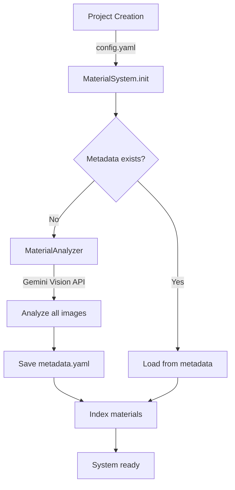
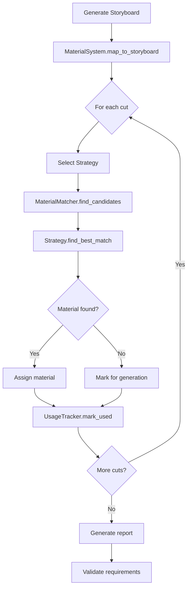

# 汎用マテリアルシステム設計書

**作成日**: 2025-01-12
**バージョン**: 1.0
**ステータス**: Draft → Implementation

---

## 目次

1. [概要](#概要)
2. [設計目標](#設計目標)
3. [アーキテクチャ](#アーキテクチャ)
4. [コンポーネント詳細](#コンポーネント詳細)
5. [ストラテジーパターン](#ストラテジーパターン)
6. [データモデル](#データモデル)
7. [ワークフロー](#ワークフロー)
8. [実装計画](#実装計画)
9. [移行ガイド](#移行ガイド)

---

## 概要

### 背景

現在、`projects/nanki-shirahama-2024/` プロジェクトには高度な素材管理システム（445行）が実装されていますが、以下の課題があります：

- **プロジェクト固有**: 南紀白浜専用のハードコード
- **再利用性低**: 新規プロジェクトでコピー&修正が必要
- **メンテナンス困難**: 複数プロジェクトで個別実装が散在

### 目的

プロジェクトタイプ（観光、教育、マーケティング等）に対応可能な**汎用マテリアルシステム**を構築し、以下を実現する：

1. **新規プロジェクトの爆速立ち上げ**（15分以内）
2. **AI自動解析による効率化**（手動作業の90%削減）
3. **コードの再利用性向上**（重複コード66%削減）
4. **保守性の向上**（1箇所修正で全体に反映）

---

## 設計目標

### 機能要件

1. **AI画像解析**
   - Gemini Vision APIを使った自動メタデータ抽出
   - カテゴリ自動分類
   - 品質評価

2. **柔軟なマッチングシステム**
   - プロジェクトタイプ別のストラテジー
   - カスタマイズ可能なスコアリング
   - 複数候補の提示

3. **詳細な追跡・レポート**
   - 使用率計算
   - 未使用理由の分析
   - カテゴリ別統計

4. **要件検証**
   - プロジェクト要件との自動照合
   - 警告・エラーの明示

### 非機能要件

1. **拡張性**: 新しいプロジェクトタイプを容易に追加可能
2. **パフォーマンス**: 100枚の素材を5秒以内で処理
3. **互換性**: 既存の南紀白浜プロジェクトと共存可能
4. **可読性**: 明確なインターフェース、充実したドキュメント

---

## アーキテクチャ

### 3層アーキテクチャ

```
┌─────────────────────────────────────────┐
│  Application Layer (使用側)              │
│  - generate_storyboard_v2.py            │
│  - project-specific scripts             │
└──────────────────┬──────────────────────┘
                   │ uses
┌──────────────────▼──────────────────────┐
│  Generic Layer (汎用層)                  │
│  ┌─────────────────────────────────┐   │
│  │ MaterialSystem                   │◄──┼── Entry Point
│  │  - Project configuration         │   │
│  │  - Component orchestration       │   │
│  └─────────────────────────────────┘   │
│  ┌─────────────────────────────────┐   │
│  │ MaterialAnalyzer                 │   │
│  │  - AI image analysis             │   │
│  │  - Metadata generation           │   │
│  └─────────────────────────────────┘   │
│  ┌─────────────────────────────────┐   │
│  │ MaterialMatcher                  │   │
│  │  - Scoring engine                │   │
│  │  - Candidate filtering           │   │
│  └─────────────────────────────────┘   │
│  ┌─────────────────────────────────┐   │
│  │ UsageTracker                     │   │
│  │  - Usage rate calculation        │   │
│  │  - Report generation             │   │
│  └─────────────────────────────────┘   │
└──────────────────┬──────────────────────┘
                   │ uses
┌──────────────────▼──────────────────────┐
│  Strategy Layer (戦略パターン層)         │
│  ┌────────────┐ ┌─────────────┐        │
│  │ Tourism    │ │ Education   │        │
│  │ Strategy   │ │ Strategy    │ ...    │
│  └────────────┘ └─────────────┘        │
└─────────────────────────────────────────┘
```

### ディレクトリ構造

```
tools/
├── __init__.py
├── material_system.py          # MaterialSystem（統括）
├── material_analyzer.py        # MaterialAnalyzer（AI解析）
├── material_matcher.py         # MaterialMatcher（マッチング）
├── usage_tracker.py            # UsageTracker（追跡）
└── matching_strategies.py      # ストラテジー実装

core/
└── materials/                  # 将来的な拡張用
    └── __init__.py

projects/
├── nanki-shirahama-2024/      # 既存プロジェクト（共存）
│   ├── config.yaml
│   ├── material_manager.py    # プロジェクト固有実装（保持）
│   └── ...
└── template/                   # 新規プロジェクト用テンプレート
    ├── config.yaml
    └── generate_videos.py
```

---

## コンポーネント詳細

### 1. MaterialSystem（統括クラス）

#### 責務
- プロジェクト設定の読み込み
- コンポーネントの初期化と統括
- ストラテジーの選択
- 高レベルAPIの提供

#### インターフェース

```python
class MaterialSystem:
    """汎用素材管理システム"""

    def __init__(self, config: MaterialConfig):
        """初期化"""

    def load_materials(self) -> List[Material]:
        """素材を読み込み（メタデータがなければAI解析）"""

    def map_to_storyboard(
        self,
        storyboard: Dict,
        allow_generation: bool = True
    ) -> Dict:
        """ストーリーボードに素材をマッピング"""

    def generate_report(self, output_path: Optional[Path] = None) -> Dict:
        """使用レポートを生成"""

    def validate_requirements(self) -> Dict[str, Any]:
        """プロジェクト要件を検証"""
```

#### 設定データ構造

```python
@dataclass
class MaterialConfig:
    """素材管理の設定"""
    project_root: Path
    project_type: str              # "tourism", "education", "marketing", etc.
    categories: List[str]          # プロジェクト固有のカテゴリ
    usage_requirements: Dict       # 使用要件（最小使用率など）
    constraints: Dict[str, bool]   # 制約（変形禁止など）
    scoring_weights: Dict[str, float]  # スコアリングの重み

    @classmethod
    def from_yaml(cls, config_path: Path) -> 'MaterialConfig':
        """プロジェクト設定ファイルから読み込み"""
```

### 2. MaterialAnalyzer（AI解析コンポーネント）

#### 責務
- Gemini Vision APIを使った画像解析
- メタデータの自動生成
- カテゴリの自動分類
- 品質評価

#### インターフェース

```python
class MaterialAnalyzer:
    """AI画像解析クラス"""

    def __init__(self, config: MaterialConfig):
        """初期化（Gemini API設定）"""

    def analyze_all_materials(
        self,
        materials_root: Path
    ) -> List[Material]:
        """全素材を解析してMaterialオブジェクトのリストを返す"""

    def analyze_image(
        self,
        image_path: Path,
        category: str
    ) -> Dict:
        """単一画像を解析してメタデータを返す"""
```

#### 解析項目

プロジェクトタイプに応じて解析項目が変わる：

**共通項目**:
- description: 画像の説明文
- main_subject: 主要な被写体
- composition: 構図タイプ
- color_tone: 色調
- quality_score: 品質スコア（0.0-1.0）

**観光プロジェクト**:
- location: 場所・ランドマーク名
- time_of_day: 時間帯
- weather: 天候
- appeal_factor: 訴求ポイント

**教育プロジェクト**:
- educational_value: 教育的価値
- complexity: 視覚的複雑さ
- focus_points: 学習ポイント

**マーケティングプロジェクト**:
- product_visibility: 商品の見やすさ
- emotional_appeal: 感情的訴求
- target_audience: ターゲット層

### 3. MaterialMatcher（マッチングエンジン）

#### 責務
- 候補素材のフィルタリング
- スコアリングによる評価
- 最適素材の選択

#### インターフェース

```python
class MaterialMatcher:
    """素材マッチングエンジン"""

    def __init__(self, config: MaterialConfig):
        """初期化"""

    def index_materials(self, materials: List[Material]):
        """素材をインデックス化して高速検索"""

    def find_candidates(
        self,
        cut: Dict,
        materials: List[Material]
    ) -> List[Material]:
        """候補素材をフィルタリング"""

    def score_material(
        self,
        material: Material,
        cut: Dict
    ) -> float:
        """素材をスコアリング"""
```

#### スコアリング要素

```python
scoring_weights = {
    'keyword_match': 5.0,      # キーワードマッチング
    'category_match': 3.0,     # カテゴリ一致
    'time_match': 2.0,         # 時間帯一致
    'mood_match': 2.0,         # ムード相性
    'quality_bonus': 1.0,      # 品質ボーナス
    'unused_bonus': 0.5        # 未使用ボーナス
}
```

### 4. UsageTracker（使用追跡）

#### 責務
- 素材の使用状況追跡
- 使用率の計算
- 詳細レポートの生成
- 未使用理由の分析

#### インターフェース

```python
class UsageTracker:
    """素材使用率の追跡"""

    def __init__(self, config: MaterialConfig):
        """初期化"""

    def mark_used(self, material_id: str, cut_number: int):
        """素材を使用済みとしてマーク"""

    def calculate_usage_rate(
        self,
        materials: List[Material]
    ) -> Dict:
        """詳細な使用率を計算"""

    def generate_detailed_report(
        self,
        materials: List[Material]
    ) -> Dict:
        """詳細な使用レポート"""

    def get_category_usage(
        self,
        materials: List[Material]
    ) -> Dict[str, int]:
        """カテゴリ別の使用数"""
```

#### レポート構造

```json
{
  "summary": {
    "used": 15,
    "total": 16,
    "rate": 0.9375,
    "percentage": "93.8%"
  },
  "by_category": {
    "beach": {"used": 4, "total": 4, "rate": 1.0},
    "nature": {"used": 4, "total": 5, "rate": 0.8}
  },
  "used_materials": [
    {
      "cut_number": 1,
      "filename": "beach_01.jpg",
      "match_score": 125.5,
      "reason": "Perfect match: location + time + HD"
    }
  ],
  "unused_materials": [
    {
      "filename": "nature_05.jpg",
      "reason": "Category oversupplied",
      "suggestions": "Consider using in variation"
    }
  ]
}
```

---

## ストラテジーパターン

### 基底クラス

```python
class MaterialMatchingStrategy(ABC):
    """素材マッチング戦略の基底クラス"""

    def __init__(self, config: MaterialConfig):
        self.config = config

    @abstractmethod
    def find_best_match(
        self,
        cut: Dict,
        materials: List[Material],
        matcher: MaterialMatcher
    ) -> Optional[Material]:
        """最適な素材を検索"""
```

### プロジェクトタイプ別実装

#### TourismMatchingStrategy

```python
class TourismMatchingStrategy(MaterialMatchingStrategy):
    """観光プロジェクト用"""

    def find_best_match(self, cut, materials, matcher):
        # 観光特有のボーナス
        # - ランドマーク名が明確 +10.0
        # - 天候が良好（sunny/clear） +5.0
        # - ゴールデンアワー +5.0
```

#### EducationMatchingStrategy

```python
class EducationMatchingStrategy(MaterialMatchingStrategy):
    """教育プロジェクト用"""

    def find_best_match(self, cut, materials, matcher):
        # 教育特有のボーナス
        # - シンプルな構図 +10.0
        # - 明るい画像 +5.0
        # - 高い教育的価値 +8.0
```

#### MarketingMatchingStrategy

```python
class MarketingMatchingStrategy(MaterialMatchingStrategy):
    """マーケティングプロジェクト用"""

    def find_best_match(self, cut, materials, matcher):
        # マーケティング特有のボーナス
        # - 感情的訴求力 +10.0
        # - 商品の視認性 +8.0
        # - 適切な構図 +5.0
```

#### CompetitionMatchingStrategy

```python
class CompetitionMatchingStrategy(MaterialMatchingStrategy):
    """コンペ用（全素材使用を優先）"""

    def find_best_match(self, cut, materials, matcher):
        # コンペ特有のボーナス
        # - 未使用素材に大きなボーナス +20.0
```

---

## データモデル

### Material

```python
@dataclass
class Material:
    """素材データクラス"""
    # 識別情報
    id: str
    filename: str
    path: str
    category: str

    # 基本情報
    width: int
    height: int
    file_size: int

    # AI解析結果
    description: str
    main_subject: str
    location: Optional[str] = None
    time_of_day: Optional[str] = None
    weather: Optional[str] = None
    color_tone: Optional[str] = None
    composition: Optional[str] = None

    # 使用状況
    assigned_to: Optional[int] = None
    match_score: float = 0.0

    # 品質指標
    quality_score: float = 0.0
    is_hd: bool = False

    @property
    def aspect_ratio(self) -> float:
        return self.width / self.height if self.height > 0 else 1.0
```

### プロジェクト設定ファイル (config.yaml)

```yaml
project:
  id: "project-name-2025"
  name: "Project Display Name"
  type: "tourism"  # tourism, education, marketing, competition, custom

requirements:
  materials:
    # カテゴリ定義（プロジェクトごとに異なる）
    categories:
      - beach
      - nature
      - attractions
      - culture

    # 使用要件
    usage_requirements:
      minimum_usage_rate: 0.75  # 75%以上使用
      allow_reuse: false        # 同じ素材の再利用

    # 制約
    constraints:
      modification_allowed: false  # 素材の改変
      aspect_ratio_fix: true       # アスペクト比固定

# スコアリング重みのカスタマイズ（オプション）
material_scoring_weights:
  keyword_match: 5.0
  category_match: 3.0
  time_match: 2.0
  mood_match: 2.0
  quality_bonus: 1.0
  unused_bonus: 0.5
```

---

## ワークフロー

### 1. プロジェクト作成フロー



### 2. 素材マッピングフロー



### 3. 使用例コード

```python
from tools.material_system import MaterialSystem, MaterialConfig

# 1. プロジェクト設定を読み込み
config = MaterialConfig.from_yaml(Path("projects/my-project/config.yaml"))

# 2. システム初期化
system = MaterialSystem(config)

# 3. 素材を読み込み（メタデータがなければAI解析）
materials = system.load_materials()
# → Gemini Vision APIで自動解析
# → metadata.yaml に保存

# 4. ストーリーボード生成（既存のコアシステム）
from core.video import CoreStoryboardGenerator
generator = CoreStoryboardGenerator(...)
storyboard = generator.generate_storyboard(...)

# 5. 素材を自動マッピング
mapped_storyboard = system.map_to_storyboard(storyboard)
# → プロジェクトタイプに応じたストラテジー自動選択
# → 各カットに最適な素材を割り当て

# 6. レポート生成
report = system.generate_report(Path("output/material_usage_report.json"))

# 7. 要件検証
validation = system.validate_requirements()
if not validation['valid']:
    print("⚠️ Requirements not met:", validation['errors'])
```

---

## 実装計画

### Phase 1: 基礎コンポーネント（2-3日）

#### 1.1 Material データクラス
- [ ] `Material` dataclass の実装
- [ ] `to_dict()` / `from_dict()` メソッド
- [ ] プロパティ（aspect_ratio, is_hd等）

#### 1.2 MaterialConfig
- [ ] `MaterialConfig` dataclass の実装
- [ ] `from_yaml()` クラスメソッド
- [ ] デフォルト値の設定

#### 1.3 MaterialAnalyzer
- [ ] 基本クラス構造
- [ ] Gemini Vision API統合
- [ ] 画像解析ロジック
- [ ] プロジェクトタイプ別プロンプト
- [ ] メタデータ保存（YAML）

**成果物**:
- `tools/material_analyzer.py`
- `tools/material_system.py`（Material, MaterialConfig）

### Phase 2: マッチングシステム（2-3日）

#### 2.1 MaterialMatcher
- [ ] 候補フィルタリング
- [ ] スコアリングエンジン
- [ ] インデックス機構
- [ ] キーワード抽出
- [ ] ムード/色調マッチング

#### 2.2 ストラテジーパターン
- [ ] `MaterialMatchingStrategy` 基底クラス
- [ ] `TourismMatchingStrategy`
- [ ] `EducationMatchingStrategy`
- [ ] `MarketingMatchingStrategy`
- [ ] `CompetitionMatchingStrategy`
- [ ] `DefaultMatchingStrategy`

**成果物**:
- `tools/material_matcher.py`
- `tools/matching_strategies.py`

### Phase 3: 追跡とレポート（1-2日）

#### 3.1 UsageTracker
- [ ] 使用状況追跡
- [ ] 使用率計算
- [ ] カテゴリ別統計
- [ ] 詳細レポート生成
- [ ] 未使用理由分析

**成果物**:
- `tools/usage_tracker.py`

### Phase 4: MaterialSystem統合（1日）

#### 4.1 MaterialSystem
- [ ] コンポーネント統括
- [ ] `load_materials()` 実装
- [ ] `map_to_storyboard()` 実装
- [ ] `generate_report()` 実装
- [ ] `validate_requirements()` 実装

**成果物**:
- `tools/material_system.py`（完成）

### Phase 5: ProjectManager統合（1日）

#### 5.1 ProjectManager拡張
- [ ] `analyze_materials()` 実装
- [ ] MaterialAnalyzer統合
- [ ] プロジェクト作成時の自動解析

**成果物**:
- `tools/project_manager.py`（拡張）

### Phase 6: テストと検証（1-2日）

#### 6.1 ユニットテスト
- [ ] MaterialAnalyzer テスト
- [ ] MaterialMatcher テスト
- [ ] ストラテジーテスト
- [ ] UsageTracker テスト

#### 6.2 統合テスト
- [ ] 南紀白浜プロジェクトで検証
- [ ] レポート生成の確認
- [ ] 要件検証の確認

#### 6.3 ドキュメント
- [ ] README更新
- [ ] 使用例作成
- [ ] APIドキュメント

**成果物**:
- `tests/test_material_system.py`
- `docs/material-system-guide.md`

---

## 移行ガイド

### 南紀白浜プロジェクトの移行

#### Before（現状）

```python
# projects/nanki-shirahama-2024/generate_tourism_videos_v2.py
from material_manager import MaterialManager

manager = MaterialManager(project_root)
manager.load_materials()

for cut in storyboard['cuts']:
    material = manager.select_material_for_scene(
        scene_description=cut['scene_description'],
        categories=cut['categories'],
        mood=cut.get('mood'),
        time_of_day=cut.get('time_of_day')
    )
```

#### After（汎用システム）

```python
# projects/nanki-shirahama-2024/generate_tourism_videos_v2.py
from tools.material_system import MaterialSystem, MaterialConfig

config = MaterialConfig.from_yaml(project_root / "config.yaml")
system = MaterialSystem(config)
materials = system.load_materials()

# ストーリーボード全体にマッピング
mapped_storyboard = system.map_to_storyboard(storyboard)

# レポート生成
report = system.generate_report(output_path / "material_usage_report.json")
```

#### 移行手順

1. **config.yaml の作成**（既存の設定を移行）
2. **コードの更新**（MaterialManager → MaterialSystem）
3. **テスト実行**（既存の機能が動作することを確認）
4. **レポート確認**（新しいレポート機能を検証）

### 新規プロジェクトの作成

```bash
# プロジェクト作成（将来的な機能）
python -m tools.project_manager create \
  --name "kyoto-tourism-2025" \
  --type "tourism" \
  --materials "path/to/photos"

# config.yaml を編集
vim projects/kyoto-tourism-2025/config.yaml

# 実行
python projects/kyoto-tourism-2025/generate_videos.py "京都の魅力"
```

---

## パフォーマンス目標

| 項目 | 目標 | 測定方法 |
|------|------|---------|
| 画像解析 | 1画像あたり2秒以内 | Gemini API レスポンス時間 |
| 素材マッチング | 100素材を5秒以内 | スコアリング処理時間 |
| レポート生成 | 1秒以内 | レポート生成処理時間 |
| メモリ使用量 | 100素材で500MB以内 | プロファイリング |

---

## セキュリティとエラーハンドリング

### APIキー管理

```python
# 環境変数から読み込み
api_key = os.environ.get('GEMINI_API_KEY')
if not api_key:
    print("⚠️ GEMINI_API_KEY not found. AI analysis will be skipped.")
    # フォールバック: 基本情報のみ
```

### エラーハンドリング

1. **API障害**: Gemini API利用不可時は基本情報のみで動作
2. **ファイル不在**: 適切なエラーメッセージを表示
3. **設定エラー**: config.yamlのバリデーション
4. **素材不足**: 警告を表示し、生成が必要な箇所を明示

---

## 将来の拡張計画

### Phase 7（将来）: 高度機能

1. **バッチ処理**
   - 複数プロジェクトの一括処理
   - 並列実行による高速化

2. **学習機能**
   - 過去のマッチング結果から学習
   - スコアリング重みの自動最適化

3. **Web UI**
   - ブラウザベースの素材管理
   - ビジュアルな素材選択

4. **バージョン管理**
   - 素材の変更履歴
   - ロールバック機能

---

## 付録

### A. 設定ファイル例

#### 観光プロジェクト
```yaml
project:
  type: tourism
requirements:
  materials:
    categories: [beach, nature, attractions, culture]
    usage_requirements:
      minimum_usage_rate: 0.75
material_scoring_weights:
  keyword_match: 5.0
  landmark_bonus: 10.0
```

#### 教育プロジェクト
```yaml
project:
  type: education
requirements:
  materials:
    categories: [diagram, experiment, equipment, result]
    usage_requirements:
      minimum_usage_rate: 0.6
material_scoring_weights:
  keyword_match: 10.0
  simplicity_bonus: 8.0
```

### B. 参考資料

- [Gemini Vision API Documentation](https://ai.google.dev/gemini-api/docs/vision)
- [Strategy Pattern (Design Patterns)](https://refactoring.guru/design-patterns/strategy)
- 南紀白浜プロジェクト実装: `projects/nanki-shirahama-2024/material_manager.py`

---

**変更履歴**:
- 2025-01-12: 初版作成

**承認**:
- [ ] 設計レビュー完了
- [ ] 実装開始承認
