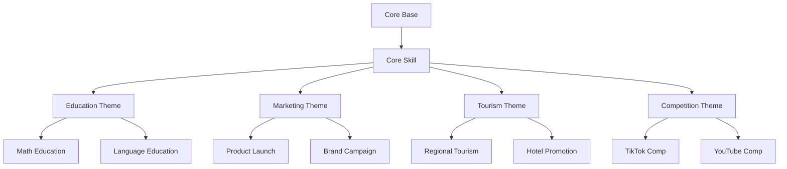
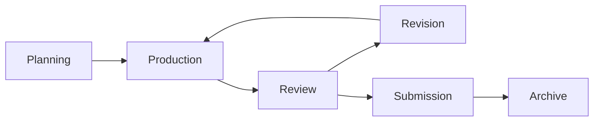

# AI動画生成スキル モジュラーシステム設計書

## 1. 概要

### 1.1 目的
多様な動画制作ニーズ（教育、マーケティング、コンペ、観光PR等）に柔軟に対応できる、拡張可能なAI動画生成スキルシステムを構築する。

### 1.2 設計方針
- **モジュラー設計**: コア機能と拡張機能を分離
- **プロジェクトベース管理**: コンペや案件ごとに独立管理
- **テーマ継承**: 共通機能を継承し、特化機能を追加
- **素材活用**: 提供素材を最大限活用する仕組み

### 1.3 対象ユーザー
- 動画制作初心者から上級者まで
- コンペ参加者
- 教育コンテンツ制作者
- マーケティング担当者
- 観光PR担当者

## 2. システムアーキテクチャ

### 2.1 全体構造

```
video-generation-system/
├── core/                              # コア機能（共通基盤）
│   ├── base/                         # 基底クラス・共通処理
│   │   ├── generator.py              # 基本生成エンジン
│   │   ├── analyzer.py               # 解析エンジン
│   │   └── optimizer.py              # 最適化エンジン
│   │
│   ├── skills/                       # コアスキル
│   │   └── ai-video-storyboard-core/
│   │       ├── SKILL.md
│   │       ├── scripts/
│   │       └── references/
│   │
│   └── shared/                       # 共有リソース
│       ├── prompts/                  # プロンプトテンプレート
│       ├── patterns/                 # デザインパターン
│       └── utils/                    # ユーティリティ
│
├── themes/                            # テーマ別拡張
│   ├── education/                    # 教育コンテンツ
│   │   ├── config.yaml
│   │   ├── skills/
│   │   └── templates/
│   │
│   ├── marketing/                    # マーケティング
│   │   ├── config.yaml
│   │   ├── skills/
│   │   └── hooks/
│   │
│   ├── tourism/                      # 観光PR
│   │   ├── config.yaml
│   │   ├── skills/
│   │   └── materials/
│   │
│   └── competition/                  # コンペ用
│       ├── tiktok/
│       ├── youtube-shorts/
│       └── general/
│
├── projects/                          # プロジェクト別管理
│   ├── template/                     # プロジェクトテンプレート
│   │   ├── config.yaml
│   │   ├── requirements.md
│   │   └── structure.json
│   │
│   └── active/                       # アクティブプロジェクト
│       ├── nanki-shirahama-2024/
│       ├── edu-science-2024/
│       └── product-launch-2024/
│
├── plugins/                           # プラグイン
│   ├── effects/                      # エフェクト系
│   ├── transitions/                  # トランジション
│   └── analytics/                    # 分析ツール
│
└── tools/                            # 管理ツール
    ├── project_creator.py            # プロジェクト作成
    ├── skill_builder.py              # スキルビルド
    └── deploy_manager.py             # デプロイ管理
```

### 2.2 コア・拡張モデル



## 3. コアシステム設計

### 3.1 基底クラス設計

```python
# core/base/generator.py
from abc import ABC, abstractmethod
from typing import Dict, List, Optional, Any

class BaseVideoGenerator(ABC):
    """すべての動画生成器の基底クラス"""
    
    def __init__(self):
        self.hooks = {}
        self.plugins = []
        self.config = self.load_default_config()
    
    @abstractmethod
    def generate_storyboard(self, input_data: Dict) -> Dict:
        """ストーリーボード生成（サブクラスで実装必須）"""
        pass
    
    def register_hook(self, event: str, handler: callable):
        """拡張ポイントの登録"""
        if event not in self.hooks:
            self.hooks[event] = []
        self.hooks[event].append(handler)
    
    def trigger_hook(self, event: str, data: Any) -> Any:
        """フックの実行"""
        if event in self.hooks:
            for handler in self.hooks[event]:
                data = handler(data)
        return data
    
    def add_plugin(self, plugin: 'BasePlugin'):
        """プラグインの追加"""
        plugin.setup(self)
        self.plugins.append(plugin)
    
    def process_plugins(self, data: Dict, stage: str) -> Dict:
        """プラグイン処理の実行"""
        for plugin in self.plugins:
            if plugin.supports_stage(stage):
                data = plugin.process(data, stage)
        return data

class BasePlugin(ABC):
    """プラグインの基底クラス"""
    
    @abstractmethod
    def setup(self, generator: BaseVideoGenerator):
        """プラグインのセットアップ"""
        pass
    
    @abstractmethod
    def supports_stage(self, stage: str) -> bool:
        """サポートするステージの判定"""
        pass
    
    @abstractmethod
    def process(self, data: Dict, stage: str) -> Dict:
        """プラグイン処理"""
        pass
```

### 3.2 コアスキル構成

```yaml
# core/skills/ai-video-storyboard-core/config.yaml
skill:
  name: ai-video-storyboard-core
  version: 2.0.0
  description: Core video storyboard generation skill
  
capabilities:
  - storyboard_generation
  - image_generation
  - prompt_optimization
  - music_generation
  - visual_analysis
  
dependencies:
  - google-generativeai>=0.3.0
  - pillow>=10.0.0
  - numpy>=1.24.0
  
extension_points:
  hooks:
    - pre_generation
    - post_generation
    - pre_image_generation
    - post_image_generation
    - music_selection
  
  plugins:
    - stage: analysis
    - stage: generation
    - stage: optimization
    - stage: output
```

## 4. テーマ別拡張設計

### 4.1 テーマ構造

```yaml
# themes/education/config.yaml
theme:
  name: education
  extends: core
  version: 1.0.0
  
specializations:
  target_audiences:
    - elementary: "小学生"
    - junior_high: "中学生"
    - high_school: "高校生"
    - university: "大学生"
    - adult: "社会人"
  
  content_types:
    - explanation: "解説動画"
    - tutorial: "チュートリアル"
    - quiz: "クイズ形式"
    - storytelling: "物語形式"
  
  pacing:
    slow: 1.5  # 通常の1.5倍ゆっくり
    normal: 1.0
    fast: 0.8
  
features:
  - subtitle_generation
  - quiz_points
  - summary_cards
  - vocabulary_highlights
```

### 4.2 テーマ実装例

```python
# themes/education/skills/education_generator.py
from core.base import BaseVideoGenerator
from typing import Dict

class EducationVideoGenerator(BaseVideoGenerator):
    """教育動画特化ジェネレーター"""
    
    def __init__(self, audience: str = "general"):
        super().__init__()
        self.audience = audience
        self.setup_education_hooks()
    
    def setup_education_hooks(self):
        """教育用フックの設定"""
        self.register_hook('pre_generation', self.add_learning_objectives)
        self.register_hook('post_generation', self.add_summary_slide)
        self.register_hook('music_selection', self.select_calm_music)
    
    def add_learning_objectives(self, storyboard: Dict) -> Dict:
        """学習目標の追加"""
        storyboard['learning_objectives'] = self.generate_objectives(
            storyboard['topic']
        )
        return storyboard
    
    def add_summary_slide(self, storyboard: Dict) -> Dict:
        """まとめスライドの追加"""
        summary = self.generate_summary(storyboard)
        storyboard['cuts'].append({
            'type': 'summary',
            'duration': 10,
            'content': summary
        })
        return storyboard
    
    def select_calm_music(self, music_options: List) -> Dict:
        """落ち着いた音楽の選択"""
        return {
            'genre': 'ambient',
            'tempo': 70,
            'mood': 'calm and focused'
        }
    
    def generate_storyboard(self, input_data: Dict) -> Dict:
        """教育用ストーリーボード生成"""
        # 基本生成
        storyboard = super().generate_base_storyboard(input_data)
        
        # 教育用カスタマイズ
        storyboard = self.adjust_pacing_for_learning(storyboard)
        storyboard = self.add_educational_elements(storyboard)
        
        return storyboard
```

## 5. プロジェクト管理システム

### 5.1 プロジェクト構造

```yaml
# projects/template/config.yaml
project:
  id: "${PROJECT_ID}"
  name: "${PROJECT_NAME}"
  type: "${PROJECT_TYPE}"  # competition, client, personal
  created: "${TIMESTAMP}"
  deadline: "${DEADLINE}"
  
requirements:
  platform:
    primary: "${PLATFORM}"
    secondaries: []
  
  duration:
    min: ${MIN_SECONDS}
    max: ${MAX_SECONDS}
    target: ${TARGET_SECONDS}
  
  aspect_ratios:
    - "16:9"  # YouTube
    - "9:16"  # TikTok, Shorts
    - "1:1"   # Instagram
  
  materials:
    provided: ${HAS_PROVIDED_MATERIALS}
    required_usage_rate: ${USAGE_RATE}
    categories: []
  
  constraints:
    - no_watermark
    - original_content
    - specific_hashtags
  
team:
  owner: "${OWNER}"
  collaborators: []
  
status:
  current: "planning"  # planning, production, review, completed
  progress: 0
  
deliverables:
  - storyboard
  - images
  - video_prompts
  - music_prompts
  - final_video
```

### 5.2 プロジェクト管理クラス

```python
# tools/project_manager.py
from pathlib import Path
from datetime import datetime
import yaml
import shutil

class ProjectManager:
    """プロジェクト管理システム"""
    
    def __init__(self, workspace: Path):
        self.workspace = Path(workspace)
        self.projects_dir = self.workspace / "projects"
        self.active_projects = {}
    
    def create_project(
        self,
        name: str,
        project_type: str,
        requirements: Dict,
        materials: Optional[Path] = None
    ) -> str:
        """新規プロジェクト作成"""
        
        # プロジェクトID生成
        project_id = self.generate_project_id(name)
        
        # ディレクトリ構造作成
        project_path = self.projects_dir / "active" / project_id
        self.create_project_structure(project_path)
        
        # 設定ファイル作成
        config = self.create_project_config(
            project_id, name, project_type, requirements
        )
        self.save_config(project_path / "config.yaml", config)
        
        # 提供素材のインポート
        if materials:
            self.import_materials(materials, project_path / "source_materials")
            self.analyze_materials(project_path / "source_materials")
        
        # プロジェクト登録
        self.active_projects[project_id] = project_path
        
        return project_id
    
    def create_project_structure(self, project_path: Path):
        """プロジェクトディレクトリ構造の作成"""
        
        directories = [
            "source_materials/required",
            "source_materials/optional",
            "source_materials/analyzed",
            "generated/storyboards",
            "generated/images",
            "generated/prompts",
            "generated/music",
            "review/drafts",
            "review/feedback",
            "submission/final",
            "submission/documents",
            "workspace/temp",
            "workspace/cache"
        ]
        
        for dir_path in directories:
            (project_path / dir_path).mkdir(parents=True, exist_ok=True)
    
    def analyze_materials(self, materials_path: Path):
        """提供素材の解析"""
        
        analyzer = MaterialAnalyzer()
        analysis_report = {
            'total_files': 0,
            'categories': {},
            'quality_assessment': {},
            'usage_recommendations': []
        }
        
        for material_file in materials_path.glob("**/*"):
            if material_file.is_file():
                analysis = analyzer.analyze(material_file)
                analysis_report['total_files'] += 1
                
                # カテゴリ分類
                category = analysis['category']
                if category not in analysis_report['categories']:
                    analysis_report['categories'][category] = []
                analysis_report['categories'][category].append(
                    str(material_file.relative_to(materials_path))
                )
        
        # レポート保存
        report_path = materials_path.parent / "analysis_report.json"
        self.save_json(report_path, analysis_report)
        
        return analysis_report
```

## 6. 素材活用型プロジェクト

### 6.1 観光PR特化設計

```python
# themes/tourism/tourism_project_handler.py
from typing import List, Dict, Optional
from pathlib import Path

class TourismProjectHandler:
    """観光PR案件専用ハンドラー"""
    
    def __init__(self, project_id: str):
        self.project_id = project_id
        self.materials_manager = TourismMaterialsManager()
        self.story_patterns = self.load_story_patterns()
    
    def analyze_destination(self, materials_path: Path) -> Dict:
        """観光地の特徴を解析"""
        
        features = {
            'natural_attractions': [],
            'cultural_sites': [],
            'activities': [],
            'accommodations': [],
            'cuisine': [],
            'seasonal_events': []
        }
        
        for image_path in materials_path.glob("**/*.jpg"):
            # Gemini Vision APIで解析
            analysis = self.analyze_tourism_image(image_path)
            category = analysis['category']
            features[category].append(analysis)
        
        return features
    
    def generate_tourism_storyboard(
        self,
        destination_name: str,
        materials: Dict,
        target_audience: str,
        duration: int
    ) -> Dict:
        """観光PR用ストーリーボード生成"""
        
        # ストーリーパターン選択
        pattern = self.select_story_pattern(
            materials, target_audience
        )
        
        # 必須要素の配置
        storyboard = self.place_key_attractions(
            pattern, materials['must_show']
        )
        
        # 感情曲線の設計
        storyboard = self.design_emotional_journey(
            storyboard, target_audience
        )
        
        # 音楽セクション設計
        storyboard['music'] = self.design_tourism_music(
            storyboard, destination_name
        )
        
        return storyboard
    
    def create_variations(
        self,
        base_storyboard: Dict,
        num_variations: int = 3
    ) -> List[Dict]:
        """複数バリエーションの生成"""
        
        variations = []
        
        # バリエーションタイプ
        variation_types = [
            'relaxation_focused',  # 癒し重視
            'activity_focused',     # アクティビティ重視
            'culture_focused',      # 文化体験重視
            'family_focused',       # ファミリー向け
            'couple_focused'        # カップル向け
        ]
        
        for i in range(min(num_variations, len(variation_types))):
            variation = self.create_variation(
                base_storyboard,
                variation_types[i]
            )
            variations.append(variation)
        
        return variations
```

### 6.2 素材マッピング

```python
# projects/nanki-shirahama-2024/material_mapping.py
class MaterialMapping:
    """提供素材とストーリーボードのマッピング"""
    
    def __init__(self, materials_path: Path):
        self.materials = self.load_materials(materials_path)
        self.usage_tracker = {}
    
    def map_materials_to_cuts(
        self,
        storyboard: Dict,
        usage_requirements: Dict
    ) -> Dict:
        """素材を各カットにマッピング"""
        
        mapped_storyboard = storyboard.copy()
        
        for cut in mapped_storyboard['cuts']:
            # 最適な素材を選択
            best_material = self.find_best_material(
                cut['requirements'],
                self.materials
            )
            
            if best_material:
                cut['source_material'] = best_material
                self.usage_tracker[best_material['id']] = cut['cut_number']
            else:
                # 新規生成が必要
                cut['generation_required'] = True
                cut['generation_prompt'] = self.create_generation_prompt(cut)
        
        # 使用率の確認
        usage_rate = len(self.usage_tracker) / len(self.materials)
        mapped_storyboard['material_usage_rate'] = usage_rate
        
        return mapped_storyboard
    
    def generate_usage_report(self) -> Dict:
        """素材使用レポート生成"""
        
        report = {
            'total_materials': len(self.materials),
            'used_materials': len(self.usage_tracker),
            'usage_rate': f"{len(self.usage_tracker) / len(self.materials) * 100:.1f}%",
            'usage_details': [],
            'unused_materials': []
        }
        
        # 使用詳細
        for material_id, cut_number in self.usage_tracker.items():
            material = self.get_material_by_id(material_id)
            report['usage_details'].append({
                'material': material['filename'],
                'used_in_cut': cut_number,
                'category': material['category']
            })
        
        # 未使用素材
        for material in self.materials:
            if material['id'] not in self.usage_tracker:
                report['unused_materials'].append({
                    'filename': material['filename'],
                    'reason': self.analyze_unused_reason(material)
                })
        
        return report
```

## 7. Claude Skills統合

### 7.1 対話型インターフェース

```python
# skills/conversation_handler.py
class ConversationHandler:
    """Claude との対話処理"""
    
    def __init__(self):
        self.context = {}
        self.project_manager = ProjectManager()
        self.theme_selector = ThemeSelector()
    
    def process_user_input(self, user_input: str) -> str:
        """ユーザー入力の処理"""
        
        # 意図解析
        intent = self.analyze_intent(user_input)
        
        if intent['type'] == 'new_project':
            return self.handle_new_project(intent)
        elif intent['type'] == 'modify_existing':
            return self.handle_modification(intent)
        elif intent['type'] == 'status_check':
            return self.handle_status_check(intent)
        else:
            return self.handle_general_query(intent)
    
    def analyze_intent(self, user_input: str) -> Dict:
        """ユーザーの意図を解析"""
        
        keywords = {
            'new_project': ['作りたい', '新しく', '作成', 'コンペ'],
            'modify': ['変更', '修正', '調整', 'もっと'],
            'status': ['進捗', '状況', 'どうなってる'],
        }
        
        intent = {'type': 'general', 'details': {}}
        
        # テーマ検出
        if '教育' in user_input or '授業' in user_input:
            intent['theme'] = 'education'
        elif '観光' in user_input or 'PR' in user_input:
            intent['theme'] = 'tourism'
        elif 'マーケティング' in user_input or '商品' in user_input:
            intent['theme'] = 'marketing'
        
        # プラットフォーム検出
        if 'TikTok' in user_input:
            intent['platform'] = 'tiktok'
        elif 'YouTube' in user_input:
            intent['platform'] = 'youtube'
        
        return intent
    
    def handle_new_project(self, intent: Dict) -> str:
        """新規プロジェクトの処理"""
        
        # テーマに応じたテンプレート選択
        if intent.get('theme') == 'tourism':
            return self.start_tourism_project(intent)
        elif intent.get('theme') == 'education':
            return self.start_education_project(intent)
        else:
            return self.start_general_project(intent)
    
    def start_tourism_project(self, intent: Dict) -> str:
        """観光プロジェクトの開始"""
        
        response = """
        観光PR動画プロジェクトを開始します！
        
        以下について教えてください：
        
        1. 観光地名：
        2. ターゲット層：
           □ 若者（20-30代）
           □ ファミリー
           □ シニア
           □ 外国人観光客
        
        3. 提供素材：
           □ あり（フォルダを指定してください）
           □ なし（すべて生成）
        
        4. 動画の長さ：
           □ 15-30秒（SNS用）
           □ 60秒（標準）
           □ 2-3分（詳細版）
        
        5. 重視したいポイント：
           □ 自然・景観
           □ グルメ
           □ 文化・歴史
           □ アクティビティ
           □ 宿泊施設
        """
        
        return response
```

### 7.2 スキル設定ファイル

```yaml
# skills/modular-video-system/SKILL.md
---
name: modular-video-system
description: Modular AI video generation system supporting multiple themes, projects, and competitions. Handles education, marketing, tourism, and competition videos with material management.
version: 2.0.0
---

# Modular Video Generation System

## 概要
テーマ別・プロジェクト別に対応可能なモジュラー動画生成システムです。

## 対応テーマ
- 教育（授業、チュートリアル）
- マーケティング（商品PR、ブランディング）
- 観光（地域PR、施設紹介）
- コンペ（TikTok、YouTube Shorts等）

## 基本的な使い方

### 新規プロジェクト開始
「〇〇の動画を作りたい」と伝えてください。
自動的に適切なテーマとテンプレートを選択します。

### 提供素材がある場合
「提供された画像を使って〇〇を作りたい」
素材フォルダを指定すると、自動解析して最適配置します。

### コンペ対応
「〇〇コンペ用の動画を作りたい」
コンペ要件を解析し、専用設定で対応します。

## 自動判定される要素
- プロジェクトタイプ
- 最適なテーマ選択
- プラットフォーム設定
- 必要な拡張機能

## カスタマイズ
各段階で調整可能です：
1. 初期設定
2. ストーリーボード
3. 画像生成
4. 音楽選択
5. 最終調整
```

## 8. デプロイメントと運用

### 8.1 ビルドプロセス

```bash
#!/bin/bash
# tools/build_skill.sh

# スキルのビルド
build_skill() {
    local theme=$1
    local output_dir=$2
    
    echo "Building skill for theme: $theme"
    
    # コアをコピー
    cp -r core/skills/ai-video-storyboard-core/* $output_dir/
    
    # テーマ拡張を統合
    if [ -d "themes/$theme/skills" ]; then
        cp -r themes/$theme/skills/* $output_dir/
    fi
    
    # 設定をマージ
    python tools/merge_configs.py \
        core/skills/ai-video-storyboard-core/config.yaml \
        themes/$theme/config.yaml \
        > $output_dir/config.yaml
    
    # パッケージング
    python tools/package_skill.py $output_dir
}

# 全テーマのビルド
build_all() {
    for theme in themes/*/; do
        theme_name=$(basename $theme)
        build_skill $theme_name "build/$theme_name"
    done
}
```

### 8.2 バージョン管理

```yaml
# version_matrix.yaml
compatibility_matrix:
  core:
    "2.0.0":
      themes:
        education: ">=1.0.0"
        marketing: ">=1.0.0"
        tourism: ">=1.0.0"
      plugins:
        - "effects:>=1.0.0"
        - "transitions:>=1.0.0"
  
  themes:
    education:
      "1.0.0":
        core: ">=2.0.0"
        breaking_changes: []
    
    tourism:
      "1.0.0":
        core: ">=2.0.0"
        required_plugins:
          - "material_analyzer"
```

## 9. 運用ガイドライン

### 9.1 新規テーマ追加手順

1. **テーマディレクトリ作成**
```bash
./tools/create_theme.sh --name "new_theme" --extends "core"
```

2. **特化機能実装**
- 必要なフックを定義
- プラグインを作成
- テンプレートを準備

3. **テスト実行**
```bash
pytest tests/themes/new_theme/
```

4. **ドキュメント作成**
- README.md
- 使用例
- API仕様

5. **デプロイ**
```bash
./tools/deploy_theme.sh new_theme
```

### 9.2 プロジェクトライフサイクル



### 9.3 保守とメンテナンス

- **週次**: アクティブプロジェクトの確認
- **月次**: 未使用リソースのクリーンアップ
- **四半期**: テーマ・プラグインの更新
- **年次**: メジャーバージョンアップ

## 10. セキュリティとプライバシー

### 10.1 APIキー管理

```python
# security/api_key_manager.py
class SecureAPIKeyManager:
    """APIキーの安全な管理"""
    
    def __init__(self):
        self.key_storage = self.init_secure_storage()
    
    def get_api_key(self, service: str) -> Optional[str]:
        """APIキー取得（優先順位付き）"""
        
        # 1. 環境変数
        key = os.environ.get(f"{service.upper()}_API_KEY")
        
        # 2. セキュアストレージ
        if not key:
            key = self.key_storage.get(service)
        
        # 3. 設定ファイル（暗号化）
        if not key:
            key = self.load_from_encrypted_config(service)
        
        return key
```

### 10.2 プロジェクトデータ保護

- 提供素材の適切な管理
- 生成物の著作権明記
- 個人情報の除外
- バックアップとリカバリ

## 11. トラブルシューティング

### 11.1 よくある問題と解決

| 問題 | 原因 | 解決方法 |
|------|------|----------|
| テーマが読み込まれない | パス設定ミス | config.yaml確認 |
| 素材解析エラー | API制限 | レート制限確認 |
| プラグイン競合 | バージョン不整合 | 依存関係更新 |
| 生成失敗 | メモリ不足 | バッチサイズ調整 |

### 11.2 デバッグモード

```python
# デバッグ設定
DEBUG_CONFIG = {
    'log_level': 'DEBUG',
    'save_intermediate': True,
    'profile_performance': True,
    'validate_outputs': True
}
```

## 12. 今後の拡張計画

### Phase 1（実装済み）
- ✅ コア機能
- ✅ 基本テーマ（教育、マーケティング、観光）
- ✅ プロジェクト管理
- ✅ Claude Skills統合

### Phase 2（開発中）
- 🔄 リアルタイムプレビュー
- 🔄 協調編集機能
- 🔄 自動品質評価
- 🔄 A/Bテスト機能

### Phase 3（計画中）
- 📋 AI推奨システム
- 📋 自動最適化
- 📋 マルチ言語対応
- 📋 クラウド連携

## 付録A: コマンドリファレンス

```bash
# プロジェクト作成
./project create --name "my_project" --theme "tourism"

# スキルビルド
./skill build --theme "education" --output "./dist"

# テスト実行
./test run --theme "all" --coverage

# デプロイ
./deploy --target "claude-desktop" --theme "tourism"
```

## 付録B: 設定ファイルテンプレート

### プロジェクト設定
```yaml
# project_template.yaml
project:
  name: "${PROJECT_NAME}"
  theme: "${THEME}"
  deadline: "${DEADLINE}"
  materials:
    provided: ${HAS_MATERIALS}
  requirements:
    platform: "${PLATFORM}"
    duration: ${DURATION}
```

### テーマ設定
```yaml
# theme_template.yaml
theme:
  name: "${THEME_NAME}"
  extends: "core"
  plugins:
    - "${PLUGIN_1}"
    - "${PLUGIN_2}"
```

---

*設計書バージョン: 1.0.0*
*最終更新: 2024年11月*
*作成: AI Video Generation System Team*
